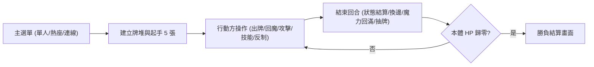

# 🃏 HD-2D 卡牌對戰 — 現行設計與開發進度

> [!abstract] **文件更新與核對說明**
> - **更新日期**：2026-09-07 ｜ 整理版 v2.1 ｜ 依本機 `card-game-demo-4.5--main` 工作樹核對。
> - **結構規範**：上半部描述目前實作，下半部保存原 v2.0 設計（原設計非完成清單）。保留原檔名與 `notion-id`。

> [!tip] **章節快速導航**
> - [[#一、閱讀方式與狀態定義|一、狀態定義]]
> - [[#二、目前遊戲定位|二、遊戲定位]]
> - [[#三、已實作進度表（優先閱讀）|三、已實作進度]]
> - [[#四、現行規則摘要|四、現行規則摘要]]
> - [[#五、尚未完成與原企劃差異|五、未完成與原案差異]]
> - [[#六、本次核對與後續交接|六、核對與交接]]
> - [[#七、原 v2.0 完整企劃案（設計保留區）|七、原設計保留區]]

---

## 一、閱讀方式與狀態定義

| 狀態標記 | 具體意義定義 |
| :--- | :--- |
| **已實作** | 在目前程式、資源與入口找到對應功能；不代表本次已重新試玩 |
| **部分實作** | 已有可用部分，但未涵蓋完整原設計 |
| **未實作** | 尚未找到完整功能或入口，保留為未完成設計 |
| **待驗收** | 程式或既有測試已存在，仍缺對應實機／連線／視覺驗證 |
| **待討論** | 原企劃與現況不同，保留差異，未自行決定刪除或改回 |

---

## 二、目前遊戲定位

- **戰略核心**：延續原本的 HD-2D 路線卡牌對戰：以站位、魔力、從者與反制互動取勝。
- **現行實裝**：已具備對局結算、單人 AI、熱座輪流操作、伺服器配對連線、牌庫圖鑑與設定介面。
- **技術棧**：Godot 4.7／Forward+ 開發；玩法權威仍以 repo 的 `README.md` Gameplay Spec 為準。以下數量另由資源實際核對。

---

## 三、已實作進度表（優先閱讀）

| 核心系統      | 實作狀態      | 目前具體內容                         | 程式依據（repo 相對路徑）                                           |
| :-------- | :-------- | :----------------------------- | :-------------------------------------------------------- |
| **對局勝負**  | 🟢 已實作    | 雙方本體、攻擊玩家、死亡與再戰／返回流程           | `src/hero/hero.gd`、`src/battle_manager/battle_manager.gd` |
| **手牌與牌堆** | 🟢 已實作    | 起手、每回合抽牌、滿手爆牌、有限牌堆、墓地          | `src/card/deck.gd`、`src/play_hand/player_hand.gd`         |
| **路線與攻擊** | 🟢 已實作    | 前後排卡槽、前排阻擋、雙向傷害、召喚暈眩           | `src/player_board/player_board.gd`                        |
| **魔力與回收** | 🟢 已實作    | 成長回滿、費用檢查、拖牌至墓地回魔與隔回合冷卻        | `BattleManager.apply_discard_for_mana()`                  |
| **五類卡牌**  | 🟢 已實作    | 從者、靈裝、秘術、瞬咒、伏印及高階卡             | `src/card/card_data.gd`、`data/cards/`                     |
| **從者效果**  | 🟢 已實作    | 主動技、戰吼、衝鋒/飛行/嘲諷/不滅/鐵壁/連擊/吸血/貫穿 | `src/card/skill_data.gd`、`src/card/card.gd`               |
| **靈裝／伏印** | 🟢 已實作    | 靈裝宿主與新蓋舊、伏印宿主與隱藏警戒、離場入墓        | `BattleManager.attach_equip()`、`set_ward()`               |
| **瞬咒反制**  | 🟡 部分實作   | 有限反制窗口及依事件觸發；未實作任意長度完整 Stack   | `BattleManager.quick_candidate()`                         |
| **單人 AI** | 🟢 已實作    | 選擇合法出牌、攻擊、技能、靈裝、伏印、反制與回魔行動     | `src/ai/enemy_ai.gd`                                      |
| **連線對戰**  | 🟢 已實作／待驗 | 選單接 `NetClient`，伺服器排隊、配對與房間流程  | `src/main_menu/main_menu.gd`、`src/net/net_client.gd`      |
| **操作與展示** | 🟢 已實作    | 拖曳、懸停預覽、扇形手牌、立牌動畫、圖鑑、傷害治療回饋    | `src/card_manager/card_manager.gd`、`card_gallery.gd`      |
| **場景與設定** | 🟢 已實作／待驗 | 森林／洞窟／冰原對戰、城鎮主選單；繁中／英文、畫質設定    | `src/environment/`、`src/settings/`                        |

---

## 四、現行規則摘要

### 1. 對局與資源機制

| 項目 | 現行實作規格 |
| :--- | :--- |
| **本體起始 HP / 勝利條件** | 20；對手 HP 歸零即分勝負 |
| **棋盤架構** | 每方 5 條路線 × 前後 2 排，共 10 個從者槽；伏印不另佔槽 |
| **魔力自然成長** | 初始上限 0，自己回合開始上限 +1 並回滿；自然上限 7 |
| **棄牌回魔** | 棄牌獲得 $\lfloor \text{Cost} / 2 \rfloor$ 暫時魔力；下個自己回合重置，使用後下一個自己回合不能再回收 |
| **回魔實例** | 自然魔力 7，棄掉 Cost 6 的牌可暫時得到 10 魔力，用以支付高階卡 |
| **起手與手牌** | 每方起手 5 張；後續換邊開始回合抽 1 張。手牌上限 8 張，溢出爆牌入墓 |
| **牌堆與抽空** | 每副 60 張、同名最多 3 份；目前由卡池隨機組成。抽空後不再抽牌，無疲勞傷害 |
| **高階卡支付** | 已實裝 9–13 費卡；自然上限不因此提高，依靠棄牌回魔等機制支付 |
| **除錯沙盒** | F8 debug 沙盒可用上限 10；不可寫成一般對戰規則 |

### 2. 卡池盤點統計

| 卡片類型 | 實際資源數 | 目前定位與功能 |
| :--- | :--- | :--- |
| **從者 (MINION)** | 66 張 | 場上戰鬥、主動技、戰吼與被動 |
| **靈裝 (EQUIP)** | 5 張 | 附著己方從者、屬性加成與特殊被動 |
| **秘術 (ARCANA)** | 33 張 | 即時施放、目標／無目標與複合效果 |
| **瞬咒 (QUICK)** | 8 張 | 符合事件及費用時反制／防禦 |
| **伏印 (WARD)** | 8 張 | 埋在己方從者底下，依特定條件觸發（含警戒標記） |
| **領域 (DOMAIN)** | 0 張 | 型別佔位，本版未啟用 |
| **總計** | **120 張** | 依 `data/cards/*.tres` 統計；未填型別者預設為從者 |

### 3. 操作與回合流轉

- **阻擋機制**：前排可阻擋同路線打臉；後排可放從者但不具阻擋效果；具備貫穿效果時可波及後排。
- **傷害結算**：從者對從者採雙向互擊傷害；攻擊本體不受反擊。預設每回合各有一次普攻與一次主動技。
- **靈裝與伏印規則**：靈裝一次一件（新蓋舊）；伏印每宿主最多一張，宿主死亡時未觸發伏印隨同入墓。

---

## 五、尚未完成與原企劃差異

| 項目 | 狀態 | 原企劃與目前實作差異 | 後續處理方針 |
| :--- | :--- | :--- | :--- |
| **魔力上限** | 待討論 | 原 v2.0 為 10，現行正式規則與程式為 7 | 上方如實記錄 7，保留原值作設計歷史；改回與否另議 |
| **獻祭召喚** | 未實作／待討論 | 原式用 Cost 且要求等號；repo 規格改為 Sacrifice + 剩餘魔力 $\ge$ Cost；資料層尚無欄位 | 實作前先定義獻祭值、超額處理與合法宿主 |
| **捨棄召喚** | 未實作 | 丟牌回魔已有，但非完整的「依單卡要求棄特定牌召喚」系統 | 分開追蹤，不因回魔完成就混為一談 |
| **完整 Stack** | 未實作／待討論 | 已有反制窗口，不等於任意長度 LIFO 後進先出回應鏈 | 保留為延伸設計 |
| **五階段切換** | 部分實作 | 有開始／結束回合處理，未見獨立 Main／Attack 階段控制介面 | 是否需要強制分階段另行討論 |
| **領域卡** | 未實作 | 原企劃全場常駐卡；目前僅為型別預留 | 不把森林等場景輪替算作領域卡完成 |
| **攻擊範圍／移動** | 部分實作 | 路線及特定打法已有；通用 `attack_range`、換位／突進尚未完成 | 依單卡設計補規格與驗證 |
| **自組牌組／經濟** | 未實作 | 圖鑑與隨機牌堆已存在，缺少完整牌組編輯與口袋經濟 | 後續另設收藏與牌組建構流程 |
| **墓地內容查閱** | 未實作 | 目前主要呈現張數與最頂層卡牌 | 補做墓地歷史檢視介面 |
| **世界觀與職業** | 草案階段 | 卡名與角色外觀不等於完整世界觀或種族職業規則 | 保留原草案，等待具體設定補齊 |
| **暗巷／賭場／天梯** | 未實作 | 無對應探索、賭卡、拍賣交易與排位賽流程 | 遠期展望，保留原設計 |
| **稀有度與色碼** | 部分實作 | 卡面已有型別章與數值，未完全套用原 v2.0 色碼系統 | 另做視覺畫面與資源對照 |
| **發行實機驗收** | 待驗收 | 匯出設定存在，不代表具備可發佈產物或線上服務驗證 | 重驗現行伺服器模式、實機與素材署名 |

---

## 六、本次核對與後續交接

| 檢查項目 | 結果與限制說明 |
| :--- | :--- |
| **靜態核對** | 工作樹、玩法規格、卡片資料與主要結算流程已完成核對 |
| **卡池統計** | 已重新精確統計 120 張資源與分類（見上表） |
| **既有測試入口** | `card_pool_verify.gd`、`high_tier_mechanics_test.gd`、`ai_strategy_test.gd` 等均在 repo 中 |
| **本次執行限制** | NOT RUN；本文「已實作」僅表示程式碼與資源存在，非本次測試全部 PASS |
| **下次更新指引** | 先查 `README.md` Gameplay Spec，再查 `src/`、`data/cards/` 與對應測試；切勿僅憑早期清單判斷 |

> 連結指向同一工作區的本機專案；搬移筆記或匯入 Notion 後可能需重新設定路徑。

- [現行玩法規格](../../repo/card-game-demo-4.5--main/README.md)
- [卡池資料](../../repo/card-game-demo-4.5--main/data/cards)
- [對局結算](../../repo/card-game-demo-4.5--main/src/battle_manager/battle_manager.gd)
- [目前連線入口](../../repo/card-game-demo-4.5--main/src/net/net_client.gd)
- [伺服器回歸測試](../../repo/card-game-demo-4.5--main/tests/server_client_test.gd)

## 原 v2.0 設計保留區

> 以下保留原始設計細節，供追溯與後續取捨；包含已改規則、未實作功能及美術目標。**目前進度與規則以上方表格為準**，不是以下每一條都已落地。原稿更新日期為 2026-04-21。

## 1. 核心玩法規則 (Core Mechanics)

### 1.1 基礎規則

- **勝利條件**：將對手主堡（玩家）生命值從 **20** 降至 **0**。
- **玩家生命值**：20 點。
- **戰場佈局**：雙方各 **5** 條並排格子（**路線 / Lane**）。
	- 每條路線可容納：**前排從者**（可被攻擊/阻擋）與其**附著的靈裝 / 伏印**（若有）。
- **攻擊規則**：
	- 若該路線前排**沒有敵方從者阻擋**，則直接攻擊對方玩家（Face）。
	- 若有阻擋，則先對該從者造成傷害。

### 1.2 資源機制（魔力 Mana）

- 遊戲開始時 **魔力上限 = 0**。
- 每位玩家在**自己回合開始時**：
	- **魔力上限 +1**（最高 10）
	- **魔力回滿至上限**
- **未使用的魔力不會累積**到下回合。
- 每回合開始時可以選擇捨棄一張牌,根據他的消耗魔力的數一半(小)回流給這回合的魔力counter(也可以不捨棄)

### 1.3 召喚機制 (Summoning Logic)

- **一般召喚**：支付卡牌右上角標示的 **Cost**（魔力）。
- **獻祭召喚 (Sacrifice Summon)**：
	- **觸發時機**：當現有魔力 < 目標卡牌魔力時，可選定場上一張卡牌進行獻祭以補足差額。
	- **計算公式**：`獻祭單位消耗魔力 + 當前剩餘魔力 = 召喚卡牌魔力`
	- **被獻祭單位的條件（需同時滿足）**：
		1. 本回合尚未承受過攻擊
		2. 本回合尚未進行攻擊
		3. 本回合尚未發動主動效果
		4. 生命值 > 50%（計算：`Math.floor(MaxHP / 2)`）
- **捨棄召喚 (Discard Summon)**：
	- **條件**：需捨棄手牌才能召喚（無視魔力或減少魔力，視單卡設計）。
	- **代價類型**：捨棄任意一張手牌 / 捨棄特定類型（如魔法卡）。
	- 獲得捨棄的卡牌的消耗點數的一半魔力

---

## 2. 回合階段與流程 (Turn Structure)

> 目標：建立清晰的「階段次序」與互動窗口（含 Stack）。可參考 MTG 的回合結構概念，但以本遊戲規則為主。

1. **開始階段（恢復階段）**
	- 魔力上限 +1、魔力回滿
	- 進行清算：解鎖從者、解除持續狀態等
	- 「回合開始時」觸發效果進入堆疊（若使用 Stack）
2. **抽牌階段**
    
	- 抽 1 張牌（牌庫用盡時的規則另行定義）
    
	-（可選）檢查手牌上限並丟棄多餘手牌
    
3. **主要階段 (Main Phase)**
	- 可使用手牌：召喚從者、施放秘術、佈置伏印、附著靈裝、啟動主動能力等
	- 玩家可自行決定進入攻擊階段的時機
4. **攻擊階段**
	- 宣告攻擊者與攻擊目標（路線/前排阻擋規則）
	- 於宣告、傷害計算前後，皆存在反應窗口（瞬咒/伏印觸發等）
5. **結束階段**
	- 回合結束檢查、處理回合末效果
	- 檢查敗亡條件（生命值 ≤ 0 判定勝負）

### 2.1 堆疊系統（Stack）

- 所有「施放的秘術 / 瞬咒」、「伏印觸發效果」、「可回應的能力」會進入堆疊。
- **結算順序：後進先出（LIFO）**：最後加入堆疊的效果最先解決。
- 雙方可在適當窗口互相回應，形成策略深度（預判、誘導、反制）。

---

## 3. 卡牌系統與邏輯 (Card System)

### 3.1 從者卡 (Unit / Followers)

- **定義**：場上實體單位，可攻擊、防禦、承受傷害，可搭載靈裝、被附伏印卡。
- **數值結構**：
	- `Cost`（藍 / 右上）：召喚所需魔力
	- `Sacrifice`（黃 / 左上）：獻祭可提供的魔力值
	- `Atk`（紅 / 左下）：攻擊力
	- `HP`（綠 / 右下）：生命值
- **技能觸發類型**：
	- **進場發動 (On Play)**：打出/召喚成功時立即生效
	- **位置觸發 (Lane Effect)**：依前排/後排、同路線單位等條件生效
	- **主動發動 (Active)**：玩家手動啟動，通常消耗資源
	- **反應觸發 (Reactive)**：如「受到攻擊時 / 受到傷害時 / 受到效果影響時」

### 3.2 靈裝卡 (Armament / Relic)

- **定義**：附著於從者上的裝備/聖物，提供持續加成或特殊能力。
- **基本規則**
	- 使用時需支付魔力，並指定 1 名從者作為宿主
	- 宿主陣亡或效果解除時，靈裝通常離場（除非卡牌另有敘述）
- **常見效果示例**
	- 「靈裝：附著後，此從者攻擊力 +X」
	- 「靈裝：此從者獲得嘲諷（Taunt）」
	- 「靈裝：此從者每次攻擊額外造成 1 點傷害」

### 3.3 魔法/秘術卡 (Spell Cards)

- **一般秘術**：主動消耗魔力施放，進入堆疊後結算，結算後離場。
- ==**反制秘術 (Counter)**：==
	- **觸發條件**：敵方發動秘術/瞬咒後（依卡牌文字）
	- **消耗**：依卡牌設定（同秘術）

### 3.4 瞬咒卡 (Flash / Reaction Spells)

- **定義**：可在對手回合或我方回合施放的反應型法術（類似 Instant）。
- **用途**：反制、打斷、保護、瞬間增益/傷害。
- **結算**：與秘術一致，進堆疊並遵循 LIFO。

### 3.5 伏印卡 (Trap / Sigil)

- **機制**：埋伏於我方某張從者卡牌後底下（Sub-layer），不立即生效。
- **消耗**：通常在埋設時支付（或免費），觸發時不再消耗。
- **觸發條件（示例）**
	- 宿主成為攻擊目標時
	- 宿主受到效果影響時
- **預設**：觸發後銷毀（若要多次觸發，需在卡面文字定義）。

### 3.6 領域卡 (Domain / Field Card)

- **定義**：影響整個戰場環境的持續性卡牌。
- **基本規則**：同時間只存在 1 張；新領域覆蓋舊領域。
- **結算建議**：可設計為「使用後立即生效並常駐」，是否進堆疊視規則統一。

---

## 4. UI/UX 視覺設計規範 (Visual Guidelines)

### 4.1 稀有度通用配色 (Rarity)

根據卡牌邊框或背景光暈區分：

- **普通 (Common)**：銀色系
- **稀有 (Rare)**：金色系
- **史詩 (Epic)**：紫色系

### 4.2 卡片類型主題配色 (Card Type Themes)

#### 魔法卡配色

- 主體背景：紫藍漸層（`#4B0082` → `#1E90FF`）
- 邊框：亮紫色（`#9400D3`）
- 魔力消耗標示：
	- 背景：皇家藍（`#4169E1`）
	- 邊框：深藍（`#000080`）
- 法術類型標籤：暗蘭花紫（`#9932CC`）
- 文字區域：白色文字配深色背景

#### 陷阱卡配色

- 主體背景：深紅漸層（`#800000` → `#FF4500`）
- 邊框：暗紅色（`#8B0000`）
- 觸發條件標籤：深紅色（`#DC143C`）
- 效果類型背景：深紅色（`#B22222`）
- 文字區域：白色文字配深色背景

|   |   |   |   |   |
|---|---|---|---|---|
|**卡牌類型**|**主體背景 (Gradient)**|**邊框色**|**特殊標籤色**|**備註**|
|**魔法卡**|紫藍漸層   `#4B0082` → `#1E90FF`|亮紫色   `#9400D3`|法術標籤：暗蘭花紫   `#9932CC`|魔力消耗標示背景：皇家藍 `#4169E1`   邊框：深藍 `#000080`|
|**反制卡**|同魔法卡|同魔法卡|同魔法卡|視覺樣式繼承魔法卡|
|**陷阱卡**|深紅漸層   `#800000` → `#FF4500`|暗紅色   `#8B0000`|觸發條件：深紅色   `#DC143C`|效果類型背景：深紅色 `#B22222`|

### 4.3 怪物卡 UI 佈局 (Monster Card UI)

|   |   |   |   |   |   |
|---|---|---|---|---|---|
|**區域**|**位置**|**數值意義**|**主色 (Background)**|**邊框色 (Border)**|**文字色**|
|**魔力值**|右上|召喚消耗|深藍色 `#0066CC`|更深藍 `#003366`|白色|
|**獻祭值**|左上|提供魔力|棕黃色 `#8B4513`|深棕色 `#4A2500`|白色|
|**攻擊力**|左下|傷害數值|紅色 `#CC0000`|深紅色 `#660000`|白色|
|**生命值**|右下|存活數值|淡綠色 `#00CC00`|綠色 `#006600`|白色|

### 4.4 場地結界 (Field Environments)

- **森林系**：綠色漸層（`#228B22` → `#90EE90`）
- **火山系**：紅色漸層（`#8B0000` → `#FFD700`）
- **海洋系**：藍色漸層（`#00008B` → `#87CEEB`）
- **永夜系**：紫色漸層（`#191970` → `#9370DB`）

---

## 5. 世界觀 / 背景設定（草案）

### 5.1 種族（示例）

- 人類：治療、支援向
- 精靈：自然魔法、敏捷
- 機械族：科技元素
- 暗影族：黑暗魔法、控制
- 獸族：力量型（秩序/混沌）
- 不死族：復活、持久戰

### 5.2 職業（示例）

- 戰士：近戰、防禦
- 法師：遠程魔法傷害
- 刺客：高爆發
- 射手：持續遠程
- 守護者：保護、控場
- 支持：增益、治療
- 工匠：機械與道具專精

---

## 6. 玩法延伸構想（保留區）

### 6.1 《貪婪之島》致敬機制 (Greed Island Inspired)

一套獨立的「咒語卡 (Spell Card)」系統，用於非戰鬥或戰鬥輔助：

- **同行 (Companion)**：傳送 (Teleport)
- **磁力 (Magnet)**：躍遷 (Warp)
- **盜竊 (Steal)**：通用搶奪
- **格擋 (Block)**：防禦性技能
- **黏手指 (Sticky Fingers)**：交換雙方的「獨特口袋」卡牌

### 6.2 遊戲模式與經濟 (Game Modes & Economy)

- **口袋系統 (Pocket System)**
	- 共通口袋：基礎卡池
	- 獨特口袋：特殊/稀有卡池
	- 稀有度：白 < 藍 < 黃（金）< 紫
- **活動場景**
	- 拍賣會：持有 10 張卡片可進入
	- 自由賭場：持有 30 張卡片可進入
- **對戰模式**
	- 天梯競技場 (Ranked)
	- 自由對戰（不賭上卡牌）

### 6.3 場景提案：無名者暗巷 (The Nameless Alley)（草案）

- **核心規則：強制匿名 (The Masquerade)**
	- 進入時強制裝備「灰色斗篷」
	- ID 隱藏，頭頂顯示「??? / 流浪者」
	- 無法打字/發話，只能使用簡單表情符號
- **地圖結構：動態迷宮 (The Maze)**
	- 俯視角 HD-2D（探索）→ 進戰鬥切回橫向
	- 迷霧 (Fog of War) + 隨機障礙（Roguelite）
	- 分流房間（20–30 人），玩家無法自選房間
- **互動機制：碰撞與決鬥 (Engagement)**
	- 面對面碰撞或互動鍵 → 發起賭卡決鬥
	- 顯示押注稀有度但不顯示卡名
	- 雙方同意後切入對戰介面
- **撤離機制：出口的博弈 (Extraction)**
	- 安全出口：隨時離開結算
	- 貪婪出口：深處，額外獎勵但高風險
- **干擾元素 (Bomberman Style)**
	- 巡邏衛兵（NPC）：碰到即扣入場費並踢出
	- 寶箱與陷阱：提升探索與遭遇率
- **鏡像 NPC（Doppelgänger Bots）**
	- 生成外觀/牌組類似真實玩家的 AI
	- 玩家勝利獲得掉落（Faucet），失敗則資源回收（Sink）

積分機制: