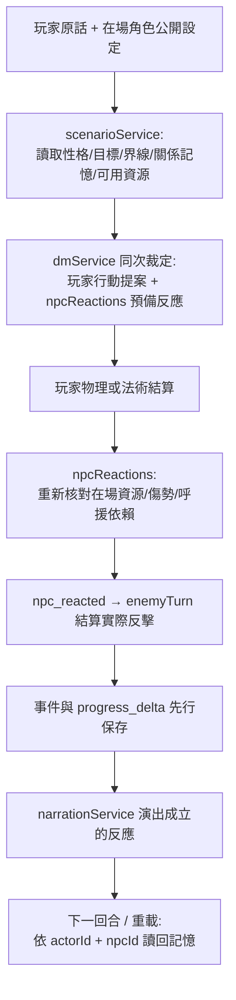

# 🧠 NPC 反應階段與持續互動記憶規劃

> [!abstract] **導航索引**
> [[README|📑 測試索引]] ｜ [[BUGS#B008|🐛 B008 追蹤]] ｜ [[判定原則與參考|⚖️ 判定原則]]

> [!info] **同步與實作狀態**
> - **同步日期**：2026-09-08。第一版已接入程式。
> - **工程唯一依據**：`ai-wrapper/docs/ROADMAP.md`
> - **實作報告**：`ai-wrapper/docs/reports/npc-reactions-2026-09-08.md`
> - **提醒**：固定裁定與單元測試不等於真模型／真人演出驗收，真模型演出仍須另外留下場次證據。

---

## 一、核心目標與覆蓋範圍

> [!tip] **設計核心**
> NPC 依**性格、工作、關係與記憶**決定反應，具備自主拒絕邀請、制止騷擾、退開、呼援或反擊的能力。
> 首批補齊生活目標與界線的角色：
> 1. 酒館老闆娘 `npc_margret`
> 2. 酒保 `npc_torin`
> 3. 守衛 `npc_rennick`
> （其餘 NPC 沿用各自公開性格、習慣及通用反應資源）。

---

## 二、已實作的資料流 (Architecture Flow)

---

## 三、模組職責與資料流分工

| 資料 / 責任模組 | 實作與消費端位置 | 功能職責說明 |
| :--- | :--- | :--- |
| **作者公開設定** | `NpcDefinition.reactionProfile`；既有 `demeanor`、`habits` | 戰鬥習性；秘密與未揭露本名**不加入** NPC prompt |
| **DM 提案契約** | `npcReactionContract.ts` $\rightarrow$ `ActionProposalSchema.npcReactions` | 沿用同一次裁定，**不增加**獨立 NPC 模型呼叫 |
| **結算與事件** | `services/npcReactions.ts`、`turnService.ts`、`enemyTurn.ts` | 物理與施法路徑串接；保留既有傷害、狀態與倒下判定 |
| **持續記憶** | `ScenarioProgress.npcRelationshipsByActorId` | 保存好感偏移、界線來源與最近重大事件 |
| **傳輸與重載** | `ScenarioProgressSchema`、訪客 `guestStorage`／`npcMemory` | 登入與多人仍保存於既有 progress JSON，無需新資料表 |
| **敘事與公開投影** | `narrationFacts`、`roomService` | 公開串流/重播**剝掉整份私人關係記憶**，僅保留可見反應 |

> [!note]
> 後端路徑相對於 `apps/trpg-server/src/`；前端位於 `apps/trpg-web/app/`。

---

## 四、行動與資源的具體含義

| 動作代號 | 第一版真正發生的行為 | 觸發與約束規則 |
| :--- | :--- | :--- |
| `respond` | 口頭回應 | NPC 做出口頭回應，該 NPC 本回合不再走自動反擊 |
| `retaliate` | 嘗試反擊 | 對目前行動者反擊；沿用戰鬥公式、擲骰與傷害規則，不保證出手或命中 |
| `call_help` | 呼援 | 向在場且可行動的 NPC 呼援（如老闆娘喊酒保/守衛隊長）；對方回應需有合法提案 |
| `retreat` | 撤退退開 | 在場內退開、停止自身攻擊並退出主動名單；留在場景可被追擊，非逃出場景 |
| `stand_down` | 停手 | 停止自身攻擊並退出主動攻擊名單 |

- 呼援鏈依成立的呼援逐段解析，提案陣列的先後不影響結果；沒有起始呼援的循環不成立。第一版沒有跨場調度援軍、瞬間新增衛隊、拘捕或 NPC 對 NPC 戰鬥的新機制。
- `after_action` 在已接受的玩家行動後判定；`after_damage` 需要指定目標本回合真的受傷；`after_downed` 需要原本未倒下的目標本回合受傷並倒下；`after_help_call` 需要呼援者確實向自己求助。
- 倒下者不能再說話、呼援或反擊，活著的目擊者可以反應。「倒下」不一律等於死亡；死亡仍依既有部位傷勢事實判定。
- NPC 的合法反應取代該 NPC 本回合舊的自動攻擊，避免求助時仍多打一拳。沒有合法反應提案的存在保留原有敵方回合規則。
- `activeEncounter.targetActorByNpcId` 保存 NPC 反擊對象：甲惹事不會讓 NPC 在乙的回合自動改打乙；乙若開始攻擊，或 NPC 合法決定轉向乙，才會改變。
- 殺傷鎮民原有的派系聲望、衛隊劇情與場景後果照常由既有結算觸發。
- 玩家行動被澄清或拒絕時，預備反應不提交。導引、接委託與地圖旅行沿用各自路徑；本版反應階段處理世界內一般行動與施法。

#### 意願、好感與記憶規則

**好感與同意分開。** `willingness` 表達當次邀請的接受、拒絕或未決定；非邀請／調情互動正規化為 `not_applicable`。接受只對應該回合與玩家原話，不能當成永久同意。高骰點不改寫 NPC 的這項判斷。

`boundary` 保存是否要求保持距離或停止交談，並另外保留來源回合。`unchanged` 保留界線，只有明確的 `reopen_conversation` 才解除；道歉、換句話說與好感上升都不會自動清掉界線。重大騷擾、威脅、暴力與目擊事件另保留 `lastIncident`。

| 規則               | 第一版值與行為                                                                                                                          |
| ------------------ | --------------------------------------------------------------------------------------------------------------------------------------- |
| 一回合反應         | 最多 6 筆，每位 NPC 至多 1 筆；非法 ID、資源或條件不成立者不提交                                                                        |
| 每對角色的近期記憶 | 最多 4 筆；另保留目前界線來源及最近重大事件                                                                                             |
| 記憶來源           | `turnId`、`sceneId`、玩家原話前 80 字及結構化分類／觸發條件／意願／動作；原話是引用資料，不能當作指令或世界事實                         |
| 全局記憶上限       | 最多 8 位行動者、128 對關係、48,000 UTF-8 bytes；先裁切較舊日常記錄，保留各對最近一次互動、界線與重大事件                               |
| 上限仍不足         | 反應照常結算，拒絕額外寫入超量關係狀態（事件的 `relationship` 為 `null`）；保留已有重要記憶，不宣稱無限記憶                             |
| 個人好感變化       | DM 只選 `none / improve / worsen`；引擎分別使用 0 / +2 / −5，個人偏移限制於 −100～100                                                   |
| 舊好感相容         | `affinityByNpcId` 或作者 `initialAffinity` 是共同基準；NPC prompt 態度＝基準＋個人偏移，夾在 −100～100。既有線索門檻不改由個人好感解鎖  |
| 舊存檔             | 沒有新欄位時讀為 `{}`；不清空角色或故事                                                                                                 |
| 重送與重播         | 事件使用絕對關係狀態；目前保留的來源回合不重複加減好感／新增記憶。登入／多人沿用既有 command 去重，訪客 SSE 使用 clientRequestId 作來源 |

訪客模式仍是無狀態 API：以完全相同的舊 progress 再送 HTTP 請求，不能承諾整個戰鬥只執行一次；已有的絕對 delta 重播不會重複累加 NPC 好感。多人則由既有 command／版本交易保證回合提交。

#### 驗收與交接

| 驗收項目                                             | 證據                                                                              |
| ---------------------------------------------------- | --------------------------------------------------------------------------------- |
| 提示詞含性格、習慣、界線與合法呼援對象，沒有作者秘密 | `npcReactions.test.ts` 的 context／prompt 測試                                    |
| 拒絕→道歉→重載；角色個別關係與界線保留               | NPC 規則測試、完整 `turnService` 測試、前端訪客存檔測試                           |
| 被攻擊、被打倒、活著的目擊者呼援、守衛反擊           | 固定裁定與骰值，走完整物理及法術回合；NPC 不重複出手                              |
| 存檔、多人隔離、公開投影與重播                       | Schema／persistent fold／訪客合併與 localStorage 往返；私人記憶不放進房間公開串流 |
| 敘事服務失敗                                         | 先提交事件與 progress，下一回合仍讀得到拒絕與界線                                 |
| 真模型／真人多回合演出                               | 待驗；自動測試不代表模型實際選擇與措辭已通過真人驗收                              |

後續工作：依真模型場次調整 prompt 與作者設定；如需遠方衛隊抵達、拘捕、完整逃離或 NPC 私人計畫，再補對應資源、狀態及驗收。B008 的真人複驗仍獨立追蹤。
