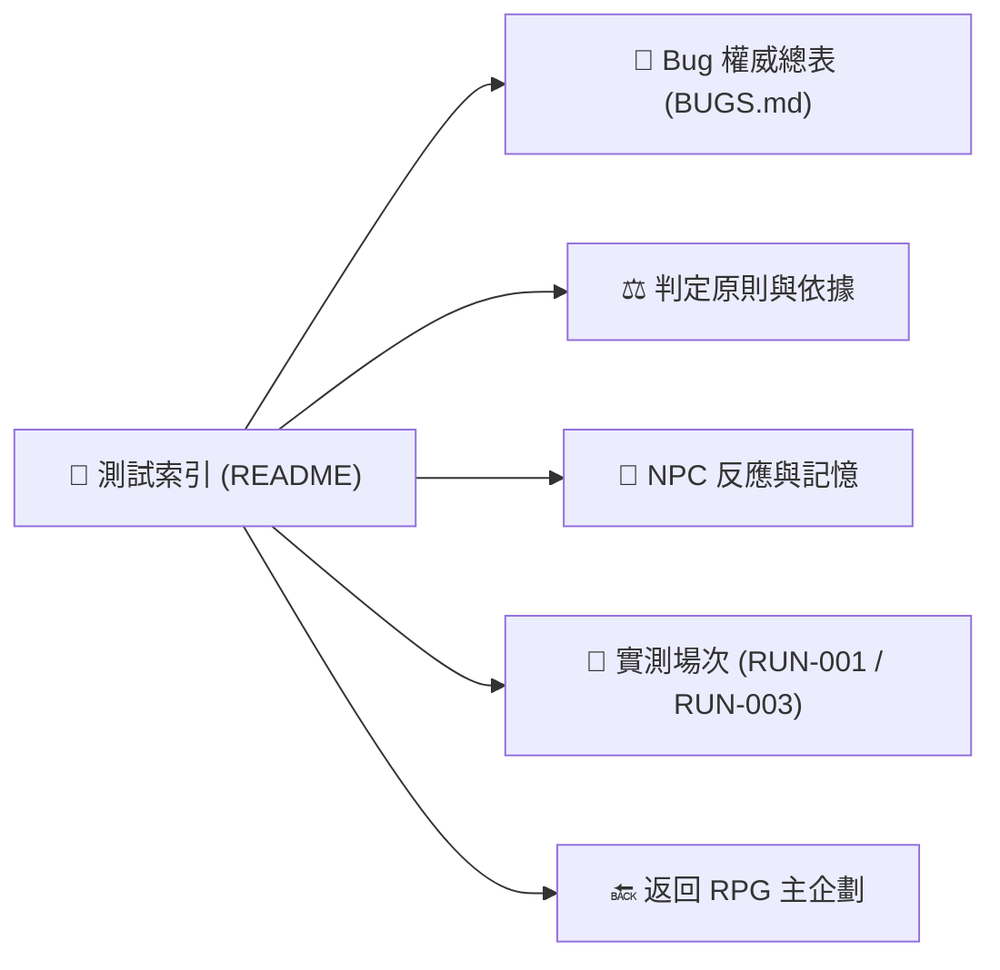

# 🎲 TRPG 實測與 Bug 紀錄索引

> [!info] **專案範疇**
> 本目錄追蹤 `ai-wrapper/apps/trpg-server` 與 `apps/trpg-web` 的 Web TRPG 開發與測試進度；不混入早期 `AI_TRPG` LINE 版的歷史帳本。

---

## ⚡ 核心文件導航



- 🐛 **Bug 總表與手動驗收**：[[BUGS|TRPG Bug 權威追蹤總表]]（已收錄 B001–B017 完整修復與待辦）
- ⚖️ **判定原則與哲學**：[[判定原則與參考|TRPG 判定原則與參考資料]]
- 🧠 **NPC 記憶系統**：[[NPC反應與互動記憶規劃|NPC 反應階段與互動記憶規劃]]
- 🔍 **擲骰時機與證據**：[[參考資料/擲骰時機與對照證據|擲骰時機判準與對照證據]]
- 📝 **新增場次範本**：[[場次範本|場次紀錄範本]]
- 🔙 **主企劃文件**：[[../../專案名稱：(待定) 2D-3D 動作 RPG 企劃案|2D-3D 動作 RPG 企劃案總覽]]

---

## 📜 實測場次索引 (Session Runs)

| 場次 | 記錄日 | 起點 / 模式 | 結果與現況 | 相關 Bug 索引 | 詳情連結 |
| :--- | :--- | :--- | :--- | :--- | :--- |
| **RUN-001** | 2026-09-07 | 銀蹄酒館 / 單人 | 止於礦坑外；回報過早觸發遊蕩結局，終局原文待補 | [[BUGS#B001|B001]]–[[BUGS#B008|B008]] | [[場次/RUN-001-銀蹄酒館/結果與觀察\|📄 檢視觀察]] · [[場次/RUN-001-銀蹄酒館/故事流程\|📜 故事流程]] |
| **RUN-003** | 2026-09-08 | 廢棄磨坊 / 賞金獵人 | 磨坊巨蜘蛛戰鬥倒下；Harvey 確認第三次真人實測 | [[BUGS#B008|B008]], [[BUGS#B017|B017]] | [[場次/RUN-003-廢棄磨坊/結果與觀察\|📄 檢視觀察]] |

> [!note]
> RUN-002 逐字稿尚未歸檔，不與第二輪工程驗證混算。

---

## 📁 檔案保存結構

```text
TRPG測試/
├── README.md                      場次與導航索引 (本文件)
├── BUGS.md                        Bug 權威總表與 Harvey 手動驗收勾選
├── 判定原則與參考.md              DM 裁定哲學、三條件、免骰原則
├── NPC反應與互動記憶規劃.md       NPC 意願、界線、反擊與跨回合記憶
├── 場次範本.md                    新增場次填寫範本
├── 修正與驗證-2026-09-07.md       首輪工程修正紀錄
├── 修正與驗證-2026-09-07-第二輪.md 第二輪工程修正紀錄
├── 場次/
│   ├── RUN-001-銀蹄酒館/
│   │   ├── 故事流程.md            保留逐句對話與操作紀錄
│   │   └── 結果與觀察.md          終局、觀察、重現與複驗
│   └── RUN-003-廢棄磨坊/
│       └── 結果與觀察.md          磨坊戰鬥、耐傷結算、部位規則
└── 參考資料/
    ├── B009-第一章線索備援盤點.md  Three Clue Rule 脊椎盤點
    ├── 擲骰時機與對照證據.md      判準 + 逐條 Bug 正反例
    ├── 使用者提供的跑團示例.txt   逐字稿原文，正例出處
    └── 前次整理-LINE版進度.md     歷史參考（非現行 Web 版）
```

> [!important] **實測與存檔原則**
> 1. 每次實測新增一個 RUN 編號（如 RUN-001、RUN-003）；檔名不強求日期，未知即標未知。
> 2. 故事、終局與原始 events 分開放進同一場次目錄，未收到的資料留待補，**不代寫造假**。
> 3. Bug 使用永久編號（B001、B002...）；重複問題追加新場次證據，**不重開同義 Bug**。
> 4. 自動測試通過不等於真人驗收。Harvey 在 [[BUGS|BUGS.md]] 勾選確認後才視為關閉；復發時保留歷史並取消勾選。

---

## 🛠️ 工程驗證進度

- [[修正與驗證-2026-09-07-第二輪|第二輪修正與驗證]]：程式變更（B004、B005、B001、B006、B010）、契約變更、單元測試 PASS、後續接續順序。
- [[修正與驗證-2026-09-07|首輪修正與驗證]]：自動測試與真人複驗分開記錄。

