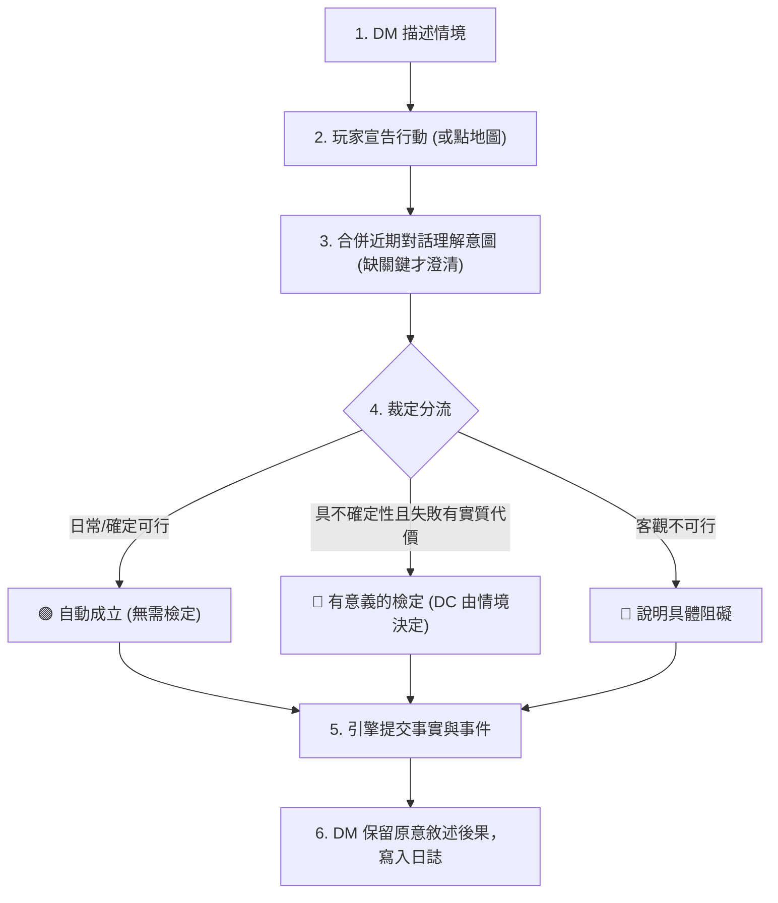

# ⚖️ TRPG 判定原則與參考資料

> [!abstract] **導航索引**
> [[README|📑 測試索引]] ｜ [[BUGS|🐛 Bug 總表]] ｜ [[參考資料/擲骰時機與對照證據|🔍 擲骰時機判準與對照證據]] ｜ [[NPC反應與互動記憶規劃|🧠 NPC 反應與記憶]]

> [!info] **核心設計方向**
> 2026-09-07 整理。這是本產品採用的 DM 裁定哲學；**不是把 D&D 5e 規則整套生硬搬入現有自訂引擎**，而是建立符合高自由度敘事與嚴謹狀態機的平衡機制。

---

## 🎯 核心原則對照表

| 面向維度 | 本產品核心原則 | 實測案例／驗收標準 |
| :--- | :--- | :--- |
| **玩家意圖** | 玩家自然語言描述；AI 理解語意，引擎驗證 ID 與能力、提交結果 | 「告示」可依情境指公告欄，不要求玩家說出精確系統物件名 |
| **擲骰時機** | **結果不確定且失敗有具體、有意義的後果才檢定**；確定能做直接敘述，確定不能做說明阻礙 | 與老闆娘日常搭話不因酒館吵雜硬加 DC；說服拒絕通行的守衛則另論 |
| **澄清機制** | 先合併前文歷史，確缺關鍵資訊才問；補對象不能把已知目的清空 | 「我接著問」承接守衛，「去哪找鎮長」已提供明確目的，不重問目的 |
| **創意與結果** | 保留玩家合理行動手法；修正保證成功的宣稱，不把自由行動改成任務導航 | 搭訕可被 NPC 接受或拒絕，不能擅自轉成任務問答（[[BUGS#B008|B008]]） |
| **NPC 意願與記憶** | NPC 依性格、處境、關係與當次意願回應；好感或骰點不自動覆蓋拒絕；成立的互動需可持久化與讀回 | 老闆娘拒絕邀請後，下回合與重載仍應記得；見 [[NPC反應與互動記憶規劃]] |
| **世界客觀事實** | 可補符合設定的氛圍描寫，**絕對不能憑空宣布可導航地點、地址或狀態改變** | 「大樓」語感可調整；但未設定的鎮長地址屬可查證缺口（[[BUGS#B007|B007]]） |
| **主動劇情鉤子** | DM 主動提供值得行動的理由與可選途徑；玩家仍保有探索或拒絕自由 | 普通聊天不當成連續拒絕鉤子，更不能以強制轉場代替玩家選擇（[[BUGS#B001|B001]]） |
| **線索備援** | 必要結論規劃至少三條獨立線索（Three Clue Rule）作為設計檢查 | 見 [[參考資料/B009-第一章線索備援盤點|B009 第一章線索備援盤點]] |
| **操作可追溯** | 文字輸入與地圖點擊均留下玩家行動與對應結果 | 點礦坑後對話應顯示「我透過地圖前往……」，再顯示抵達描述（[[BUGS#B006|B006]]） |

---

## 🔄 互動與裁定循環流轉

> [!tip] **詳細判準與正反例**
> 擲骰時機的完整判準（三條件、該擲／不該擲對照表、行動四分類白名單）與逐條 Bug 正反例，詳見 [[參考資料/擲骰時機與對照證據|擲骰時機與對照證據]]。

---

## 📚 理論與設計參考來源

- 📖 **D&D 2024 Basic Rules: Playing the Game**：官方說明情境描述 $\rightarrow$ 玩家宣告 $\rightarrow$ DM 裁定的核心循環；不確定性與實質失敗代價是能力檢定的唯一出發點。
- 🛠️ **Sly Flourish: Ability Check Toolbox**：討論如何讓檢定隨機性真正產生戲劇性，並在不需要時果斷略過檢定。本產品據此杜絕用骰子阻礙正常探索。
- 🎙️ **Matt Colville《Running the Game》**：「玩家通常是被動反應的（reactive not proactive），DM 要主動拋出令人無法忽視的強烈鉤子」；據此要求 DM 主動給動機，但不因玩家短暫探索就草率收束。
- 🔍 **The Alexandrian: Three Clue Rule**：任何推進劇情的必要結論至少準備 3 條獨立線索，避免單一檢定失敗造成全劇本死鎖。
- 📜 **使用者跑團示例**：見 [[參考資料/使用者提供的跑團示例.txt|使用者提供的跑團示例]]（留存作為互動節奏之對照參考）。

---

## 🚫 不直接照搬的機制

> [!warning] **自研引擎與傳統 TRPG 邊界**
> 1. **「倒地補刀必定自動命中／處決」**：非本次建立之通則；攻擊、抗性與失能仍依引擎耐久度公式嚴格計算。
> 2. **「失敗讓故事有趣 (Fail Forward)」**：用於設計失敗後的戲劇後果，但非要求每次失敗都給予好處；更不可用連續檢定將關鍵情報永久刪除。
> 3. **提示詞不能取代引擎防線**：提示詞僅為模型行為指引，不能作為零幻覺的保證；B004、B005、B007、B008 等必須有引擎層數據檢驗與白名單注入。

