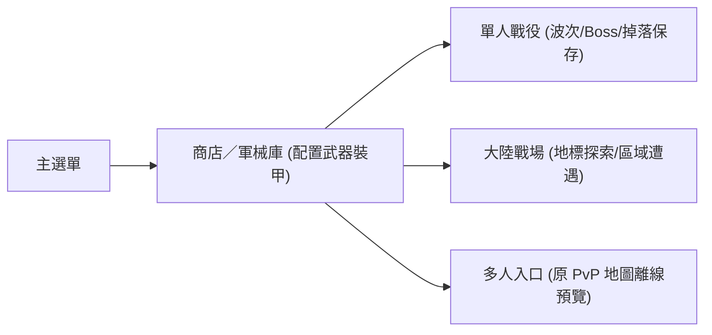

# 🚀 StarWarfare — 已實作基礎與未來展望

> [!abstract] **文件更新與工作樹說明**
> - **更新日期**：2026-09-10 ｜ 整理版 v0.5 ｜ 新增 [[#Current 進度（2026-09）|Current 進度]]、[[#未來困境與風險（借鏡）|未來困境與風險]]；原 v0.3 展望仍保留於文末。
> - **核對工作樹**：本機 `star-warfare-godot`；`star-warfare` 是原 Unity 復原來源，**不能把原始碼或素材存在直接當成 Godot 功能已完成**。保留原檔名與 `notion-id`。

> [!tip] **章節快速導航**
> - [[#一、定位與狀態|一、定位與狀態]]
> - [[#二、已實作進度（先看這裡）|二、已實作進度]]
> - [[#三、規模與現行限制|三、規模與現行限制]]
> - [[#四、已有換彈範圍|四、已有換彈範圍]]
> - [[#五、目前遊戲流程與展望關係|五、遊戲流程與展望關係]]
> - [[#六、必須先討論的原案衝突|六、原案衝突分析]]
> - [[#七、建議後續順序（供討論）|七、建議開發順序]]
> - [[#Current 進度（2026-09）|Current 進度]]
> - [[#未來困境與風險（借鏡）|未來困境與風險]]
> - [[#原 v0.3 完整展望（設計保留區）|八、未來展望與數值框架（原稿）]]

---

## 一、定位與狀態

- **目前可用基礎**：Godot 離線第三人稱射擊復原版，已有戰役、武器、裝甲、商店、存檔，並加入大陸戰場與部分換彈玩法。
- **未來目標**：在此基礎上發展手機優先、PC 輔助的 PvE／PvP 射擊遊戲，建立商店與寶箱雙軌裝備、配件、模塊與質變。
- 未來展望不因尚未實作而刪除；現有復原系統也不直接算成新設計的完成品。

| 狀態標記 | 具體意義定義 |
| :--- | :--- |
| **已實作** | 現行程式與入口有對應功能，本次未重新遊玩驗收 |
| **部分實作** | 有基礎或限定範圍，但尚未完成展望中的完整系統 |
| **未實作** | 尚無完整可用系統，保留在展望 |
| **待驗收** | 需要實機、畫面、連線或行為驗證 |
| **待討論** | 規格矛盾或產品取捨尚未定案，不自行改動原值 |

---

## 二、已實作進度（先看這裡）

| 系統模組 | 實作狀態 | 目前具體內容 | 程式依據（Godot repo 相對路徑） |
| :--- | :--- | :--- | :--- |
| **單人戰役** | 🟢 已實作 | 原關卡載入、敵人波次、Boss、勝敗、掉落與進度 | `scripts/game/game_world.gd`、`scripts/core/game_state.gd` |
| **原場景復原** | 🟢 已實作／視覺待複驗 | 原關卡地形、材質、碰撞、出生點、路徑節點與選單縮圖 | `assets/models/levels/`、`scripts/core/unity_collider_builder.gd` |
| **第三人稱操作** | 🟢 已實作 | 肩後鏡頭、移動、衝刺、聚焦瞄準、射擊、切槍、受傷與護盾 | `scripts/game/player.gd` |
| **武器系統** | 🟢 已實作 | 原武器資料、射擊類型、武器模型與攻擊回饋 | `GameState.WEAPON_ROWS`、`scripts/game/projectile.gd` |
| **彈匣與換彈** | 🟡 部分實作 | 指定武器具不同換彈方式、彈匣／彈殼演出，散彈可中斷裝填 | `GameState.RELOAD_PROFILES`、`scripts/game/player.gd` |
| **裝甲／背包／套裝** | 🟢 已實作 | 原裝甲購買、裝備、四部位套裝、背包容量與外觀 | `scripts/core/armor_catalog.gd`、`scripts/core/game_state.gd` |
| **裝甲主動技能** | 🟢 已實作 | 原技能效果、持續時間、冷卻與 HUD 顯示 | `scripts/game/armor_power_controller.gd`、`scripts/ui/hud.gd` |
| **商店與軍械庫** | 🟢 已實作 | 武器/裝甲分類、解鎖階級、Credits／Mithril 購買與持有預覽 | `scripts/ui/main_menu.gd`、`scripts/ui/unity_equipment_shell.gd` |
| **補給品商店** | 🟡 部分實作 | 已有分類、購買、庫存上限與保存；尚未接完整戰鬥使用接線 | `scripts/core/props_catalog.gd`、`GameState.purchase_prop()` |
| **敵方 AI／難度** | 🟢 已實作／體驗待驗 | 追擊與路徑、戰術難度設定、包抄／攻擊名額／預警行為 | `scripts/game/enemy.gd`、`GameState.DIFFICULTY_PROFILES` |
| **大陸戰場** | 🟢 已實作／體驗待驗 | 連續地形、原場景地標、動態載入與回收、區域遭遇 | `scripts/game/expanse_world.gd`、`expanse_terrain.gd` |
| **存檔、語言與畫質** | 🟢 已實作 | 本機 JSON 保存、繁中／英文、畫質選項 | `scripts/core/game_state.gd`、`scripts/core/localization.gd` |
| **多輸入與音畫** | 🟢 已實作／實機待驗 | 鍵鼠、控制器、手機雙搖桿；復原音樂音效、角色動畫、HUD | `scripts/ui/virtual_joystick.gd`、`scripts/core/audio_director.gd` |

---

## 三、規模與現行限制

| 項目 | 核對真實結果 | ⚠️ 不能誤認為（常見誤區） |
| :--- | :--- | :--- |
| **單人關卡** | Level 1–8，共 8 關；`CAMPAIGN_FULLY_UNLOCKED = true` 供測試 | 正式平衡後的解鎖／養成流程已驗收完成 |
| **PvP 地圖** | Level 13–21，共 9 張；入口明示離線預覽，無 PvE 波次 | 已具備真人連線 PvP 功能 |
| **原場景總數** | 17 張關卡資源 | 17 關完整 PvE 戰役劇情 |
| **武器資料** | 47 把，來自 `WEAPON_ROWS` | 47 把已具新配件、模塊與滿級質變 |
| **裝甲** | 21 套 × 4 部位 + 25 背包，共 109 件 | 新展望的品質選槽／商店寶箱雙軌已完成 |
| **武器裝備欄** | 最大 8 格，新增裝備受背包容量限制 | 每個背包都固定能裝 8 把武器 |
| **裝甲主動技能** | 10 種原技能定義 | 未來企劃「下次再死／動能／腎上腺素」等方案已落地 |
| **補給品** | 11 項（HEALTH 6、AID-KIT 2、ASSIST 3；上限 99） | 全部效果已能在戰鬥中即時施放 |
| **大陸尺寸** | 3000 × 3000 引擎單位，17 個地標（設計尺寸） | 真實地理公里數、量測過的流暢度或完整開放任務 |
| **付費** | 本機保存之 Credits／Mithril 虛擬商店；選單說明服務離線 | 真實付費、帳號與官方伺服器已恢復 |

---

## 四、已有換彈範圍

| 武器 ID | 換彈類型 | 彈匣容量 | 基礎換彈時間（程式參數） |
| :--- | :--- | :--- | :--- |
| `gun00` | 步槍彈匣 | 30 發 | 1.55 秒 |
| `gun35` | 狙擊彈匣 | 5 發 | 2.18 秒 |
| `gun06` | 散彈逐發裝填 | 6 發 | 每發 0.68 秒（可隨時中斷） |
| `gun11` | 火箭裝填 | 1 發 | 2.42 秒 |
| `gun14` | 榴彈轉鼓 | 4 發 | 2.05 秒 |

- 目前備彈設為無限；舊 Energy 帳仍保留並在射擊時消耗，是過渡實作。其餘武器不能因上述樣板存在就列為全面完成。
- 現有瞄準改變 FOV 與肩後鏡頭距離，尚未找到「裝瞄準鏡才切第一人稱」的配件條件與完整模式。

---

## 五、目前遊戲流程與展望關係



| 現有已實作基礎 | 未來預計增加內容 | 開發進度判定 |
| :--- | :--- | :--- |
| 原商店購買武器 | 升級、分階段開配件槽、滿級質變 | 原商店已實作；新成長系統未實作 |
| 固定武器目錄 | 隨機寶箱、品質、模塊、元素與重複品 | 未實作 |
| 原四件套裝與背包 | 寶箱裝甲選槽、跨等級混搭規則、黑箱背包取得 | 原裝備已實作；新取得與加成未實作 |
| PvP 場地預覽 | 配對、房間、數值驗證、標準化房、PvP 曲線 | 未實作 |
| 射擊與部分換彈 | 配件瞄具第一人稱、副模式、質變池 | 部分基礎存在；新系統未實作 |
| 本機貨幣與道具庫存 | 寶箱鑰匙、機率、付費與長期經濟 | 未實作 |
| 戰役、大陸場地與 Boss | 主線世界觀、進階 Boss 機制與長期任務 | 基礎已實作；新內容未完成 |

---

## 六、必須先討論的原案衝突

> [!important] **規格比對說明**
> 本次保留原值與方向，不代替產品做平衡決策。下列是文件算式核對及規格比對結果，並非遊戲實測結論。

> [!warning] **衝突 1：終局表與乘法公式不一致**
> - **現象**：使用原表近似值計算：`1.33 × 1.72 × 1.4 = 3.20264`，已經嚴重超過設定的上限 `2.3x`，也高於黑箱表的約 `2.20x`。
> - **建議處理**：先定義基準與品質是否已包含在終局數值中，再統一重算公式；不私下修改任一倍率。

> [!warning] **衝突 2：「Soft Cap」與絕對上限定義混用**
> - **現象**：原文敘述「任何情況不得超過 `2.3x`」；若絕對不准超過，代表為硬性封頂（Hard Cap），與「超過後收益遞減」的軟上限（Soft Cap）矛盾。
> - **建議處理**：明確選擇硬上限、遞減收益曲線或純設計目標，再進行數值實作。

> [!warning] **衝突 3：等級分段表與配件樹範圍不同**
> - **現象**：武器成長表僅列至 `Lv.8`，但配件解鎖樹卻在 `Lv.12` 才開啟槍托槽。
> - **建議處理**：確認是否為不同系統的等級；若屬同一武器等級系統，需統一兩張表格的等級上限。

> [!warning] **衝突 4：不同屬性百分比不能直接相加當作 DPS**
> - **現象**：傷害 `+12%` 與射速 `+10%` 同時生效時，未計其他因素的實質收益為 `1.12 × 1.10 = 1.232`，不是線性相加的 `1.22`。
> - **建議處理**：同屬性內可加總，傷害／射速／爆擊需分開代入乘法公式；並明確定義換彈時間是否納入實戰 DPS 計算。

> [!warning] **衝突 5：DPS 提升值缺乏實際量測依據**
> - **現象**：紅點鏡「有效 DPS +8%」、滿配「1.25–1.45x」等描述未附帶命中率、距離或特定測試條件。
> - **建議處理**：視作企劃初期的估算目標，不直接當作平衡測試通過的標準。

> [!warning] **衝突 6：背包新舊取得規則衝突**
> - **現象**：Godot 現行已有商店背包可直接購買，但未來展望卻將背包列為「黑箱專屬」。
> - **建議處理**：決定此規則僅對新增背包生效，或是全面重做背包取得流程。

> [!warning] **衝突 7：電漿 PvP 平衡表引用未定義效果**
> - **現象**：PvP 表提及「鏈電目標數減半、地雷最多 1 顆」，但質變池並未完整定義對應的目標數與地雷項目。
> - **建議處理**：先補齊效果規格或標記為保留項，不直接列入驗收清單。

---

## 七、建議後續順序（供討論）

| 推薦階段 | 核心工作項目 | 驗收方向 |
| :--- | :--- | :--- |
| **第 1 階段：穩定底盤** | 射擊、換彈、裝備、存檔、手機操作與現有場景 | 跑既有自動測試，驗證實機畫面與操作手感 |
| **第 2 階段：統一生長規格** | 武器等級、配件槽、DPS 基準與上限計算 | 以同一套數學公式重算原表，消除上述數值衝突 |
| **第 3 階段：完整裝備流程** | 取得 $\rightarrow$ 裝配／升級 $\rightarrow$ 戰鬥生效 $\rightarrow$ 保存 | 先完成 1 把樣板武器之端到端驗收，再行擴展 |
| **第 4 階段：擴充寶箱與裝甲** | 品質、模塊、選槽、混搭與經濟體系 | 明確區隔新系統與原復原裝備 |
| **第 5 階段：真人連線與 PvP** | 配對、對戰結算、PvP 獨立數值與天平系統 | 離線場景預覽不可充當連線完成證據 |


## 本次核對與限制

| 檢查 | 結果 |
|---|---|
| Godot 工作樹、README、遊戲狀態、玩家、商店、裝甲、大陸與測試來源 | 已靜態核對 |
| 武器、換彈設定、裝甲／補給目錄、場景數量 | 可由現有資料重新統計，本文依此區分進度 |
| 既有驗證入口 | `tests/restoration_test.tscn`、`armor_system_test.tscn`、`armor_power_test.tscn`、`reload_system_test.tscn`、`props_store_test.tscn`、`expanse_test.tscn` 等 |
| 本次引擎測試／視覺截圖／手機／控制器／匯出 | NOT RUN；不把歷史 README 的完成描述冒充此次 PASS |
| 線上服務／付費／真正 PvP | 未確認且現行文件明示離線限制；不列已完成 |

## 核對來源連結

> 連結指向同一工作區的本機專案；搬移筆記或匯入 Notion 後可能需重新設定路徑。

- [復原範圍與說明](../../repo/star-warfare-godot/README.zh-TW.md)
- [武器與換彈目錄](../../repo/star-warfare-godot/scripts/core/game_state.gd)
- [原裝甲目錄](../../repo/star-warfare-godot/scripts/core/armor_catalog.gd)
- [大陸戰場](../../repo/star-warfare-godot/scripts/game/expanse_world.gd)
- [換彈回歸測試](../../repo/star-warfare-godot/tests/reload_system_test.gd)

## Current 進度（2026-09）

> [!summary] **一句話**
> 現在是「原作離線復原版已可玩」的階段；產品方向已寫成手機優先的 PvE／PvP 成長射擊，但新成長、連線、經濟幾乎都還沒開工。

### 產品方向（文件已定、程式未到）

| 層級 | 內容 |
| :--- | :--- |
| **定位** | 手機為主、PC 為輔的第三人稱過肩射擊；秒瞄可切第一人稱（需瞄準鏡配件） |
| **模式** | PvE（主線／Boss）+ PvP；兩者規則與數值分開 |
| **成長主軸** | 商店武器（目標向）與寶箱武器（隨機向）雙軌；配件、模塊、滿級質變 |
| **裝甲主軸** | 商店套裝 vs 寶箱選槽互補；背包為獨立第五欄 |
| **借鑑** | Star Warfare 1、Call of Mini: Infinity、SAS: Zombie Assault 4 |
| **硬約束（設計）** | 終局 DPS 倍率不超過約 `2.3x`（文件仍寫 Soft Cap，與 Hard Cap 定義仍衝突，見第六節） |

### 工程進度落點（對照第七節階段）

| 階段 | 狀態 | 現況摘要 |
| :--- | :--- | :--- |
| **1 穩定底盤** | 🟡 進行中／待實機複驗 | 戰役、大陸、商店／裝甲、存檔、多輸入、部分換彈樣板已在；仍有體驗與畫面待驗 |
| **2 統一生長規格** | 🔴 未開始 | 等級／配件／DPS 公式仍有原案衝突，尚未定案重算 |
| **3 完整裝備流程** | 🔴 未開始 | 尚無「取得 → 裝配／升級 → 戰鬥生效 → 保存」端到端樣板槍 |
| **4 寶箱與新裝甲經濟** | 🔴 未開始 | 品質、模塊、選槽、鑰匙／機率皆屬展望 |
| **5 真人連線與 PvP** | 🔴 未開始 | 僅有 Level 13–21 離線場地預覽；無配對、房間、結算 |

### 已有 vs 尚未有（決策用）

| 已有（可當底盤） | 尚未有（仍屬展望） |
| :--- | :--- |
| 單人 Level 1–8、波次／Boss、掉落與本機存檔 | 主線世界觀、進階 Boss、長期任務循環 |
| 大陸戰場串流與區域遭遇 | 大陸任務／進度經濟閉環 |
| 47 武器、109 裝甲／背包、原商店與技能 | 配件樹、質變池、寶箱品質／模塊 |
| 5 把樣板換彈、肩後瞄準 | 瞄具條件第一人稱、副模式、備彈正式化 |
| PvP 地圖離線預覽 | 配對、P2P／專服、排位、標準化房 |
| Credits／Mithril 虛擬商店 | 真實付費、帳號、鑰匙與長期經濟 |

### 目前最大落差

- **復原完成 ≠ 新產品完成**：可玩循環是舊 Star Warfare 離線版；文末 v0.3 是未來產品規格庫。
- **規格未先統一就擴系統**：第六節 7 項衝突若未解，後面配件／寶箱／PvP 曲線會反覆重做。
- **建議下一刀仍卡在第 1→2 階段交界**：先鎖可量測的射擊／換彈／裝備底盤，再統一生長數學，不要並行開連線與全套經濟。

---

## 未來困境與風險（借鏡）

> [!warning] **來源說明**
> 以下把外部案例（1047／《Splitgate 2》／《Empulse》等）的**機制性教訓**對到本專案；不是斷言那些公司的內部帳本，也不是替本專案預判必然失敗。目的是提早標出「玩法有潛力」與「產品養得起」之間常見的斷層。

### 核心提醒（先讀這三句）

1. **「有潛力的遊戲」「能長期賺錢的產品」「能擴張成大團隊的組織」是三件不同的事。**
2. **核心手感被稱讚 ≠ 整體產品健康**；前者不能單獨當成可以正式上市或一次開很多模式的證據。
3. **第一階段要驗證的是留存與成本**，不是功能清單有多長。

### A. 產品與範圍

| 困境 | 對本專案的具體樣貌 | 預防方向 |
| :--- | :--- | :--- |
| **野心超過完成能力** | 展望同時含雙軌武器、質變池、裝甲選槽、多種 PvP、經濟課金；底盤仍在復原／樣板階段 | 一次只交付一條可驗收主幹（例如一把樣板槍的完整成長），其餘留在設計庫 |
| **同時服務兩種產品** | 想給老玩家「純粹續作」，又想用大量新系統拉新玩家，兩邊都半套 | 先保住可重複遊玩的核心循環，再擴張差異化系統 |
| **用功能數量代替驗證** | 背景、舞蹈、裝備、多模式都可寫進方向，但擋不住「下週還會不會回來」沒答案 | 優先回答：上手、再開一場、下週回流、願意帶朋友、輸了是否懂原因 |

### B. 模式與營運

| 困境 | 對本專案的具體樣貌 | 預防方向 |
| :--- | :--- | :--- |
| **玩家喜歡的體驗不常開** | 《Empulse》式問題：喜歡步兵手感，卻被排進不喜歡的模式 → 直接退出 | 常態入口必須對準「玩家留下來的理由」；測試用限時模式不可變成唯一可玩內容 |
| **模式切太碎，配對池死掉** | 展望有多種 PvP／房間分層；人少時十幾個隊列會讓「遊戲不錯但配不到人」 | 初期只開少數模式（如 TDM、King of the Hill、自訂房輪替）；排位／CTF／拆彈等人夠再開 |
| **不同受眾硬合併** | 只有玩家願意互相替代的模式才適合合併隊列 | 先確認受眾是否同一偏好，再談「集中配對」 |

### C. 商業與信任

| 困境 | 對本專案的具體樣貌 | 預防方向 |
| :--- | :--- | :--- |
| **信任未穩就先收錢感** | 文件已有鑰匙／課金切入；若核心與連線未成熟就強調商城，玩家會解讀成優先順序錯誤 | 商城可設計，但公開產品健康前先證明免費循環好玩、公平 |
| **把失敗全怪成貪婪／單一爭議** | 提早上市可能是財務、判斷、範圍失控或驗證樣本失敗——解法不同 | 出問題時拆決策類型，不要用單一歸因擋住真正該修的環節 |
| **小而健康 vs 先長成大廠成本** | 融資／擴張會把「成功門檻」抬高；同一款遊戲可能養得起十人、養不起百人 | 先以「少量玩家也能玩得好、團隊也養得起」為成功定義 |

### D. 技術與關服韌性

| 困境 | 對本專案的具體樣貌 | 預防方向 |
| :--- | :--- | :--- |
| **全部專服 → 活不下去就整款消失** | 目前連線尚未做，仍有機會從第一天分開「規則」與「傳輸」 | 同一戰鬥系統可跑：離線本機／P2P 房主／Headless 專服 |
| **全部 P2P → 排位與公平崩壞** | 四人 PvE／自訂房適合房主制；排位等需要權威伺服與反作弊 | 混合架構，不要二選一教條 |
| **P2P 仍依賴中央服務** | 房間列表、登入、中繼若全關，遊戲仍可能連不上 | 預留 LAN、房間碼／直連、可選離線進度；房主轉移列為評估項，不必塞進第一版 |
| **建議切分（規劃用）** | 單人 PvE 離線；4 人任務／私人房 P2P；排位與高公平模式專服；背包／商城／軍階用輕量中央服務 | 戰鬥伺服器成本不要跟帳號經濟綁死 |

### E. 第一階段必答（未答就不該談「做大」）

- 新玩家是否很快理解移動、瞄準、換彈與速度機制？
- 四人打完一場任務後，是否主動再開一場？
- 不靠邀請，他們下週是否還會回來？
- 他們會不會帶朋友，而不只是說「做得不錯」？
- PvP 新手是否能理解自己為什麼輸？
- 玩家數不大時，連線與維護成本是否仍可負擔？

### F. 與本文件既有衝突的銜接

- 第六節數值／取得規則衝突若拖著擴系統，等於自製「反覆重做」路徑（與外部案例的上市過早／重做成本同類）。
- 第七節階段順序已是對「範圍失控」的內部剎車；本節是補上**市場、模式營運、網路成本**的外部剎車。

---

## 原 v0.3 完整展望（設計保留區）

> 以下為未來方案，並非目前功能清單。原表的 ✅／❌ 表示「設計允許／禁止」，**不表示開發完成／未完成**。傷害倍率、機率、DPS 增益與各類強度比較均為未經本次實測的設計值／估算；已知矛盾見上表。功能進度以上方表格為準。

# 1. 概覽 Overview

|項目|說明|
|---|---|
|平台|手機為主，PC 為輔|
|視角|第三人稱過肩；秒瞄時切換第一人稱（需瞄準鏡配件）|
|風格|第三人稱過肩動作射擊，操作簡潔|
|模式|PvE（主線 / Boss）、PvP（對戰）|
|UI 參考|Star Warfare 1，簡潔 HUD，最多加一個瞄準按鈕|
|借鑑作品|Star Warfare 1、Call of Mini: Infinity、SAS: Zombie Assault 4|

## 1.1 設計核心原則

- 操作簡潔，上手門檻低
- 武器系統具備深度，長期留存
- 兩套武器系統服務不同玩家偏好，互不踩踏
- PvP 與 PvE 規則集分離，各自平衡
- **任何武器最終 DPS 倍率不超過 2.3x（Soft Cap）**

---

# 2. 數值核心框架

## 2.1 基準模型（所有平衡的錨點）

定義一把「基準步槍」，所有武器數值皆以此為倍率基準：

```
基礎傷害（Damage）    = 100
射速（RPM）           = 600
爆擊率（Crit Chance） = 10%
爆擊倍率（Crit Mult） = 150%
```

**DPS 公式（含爆擊）：**

```
DPS = Damage × (RPM / 60) × (1 + CritChance × (CritMultiplier - 1))
    = 100 × 10 × (1 + 0.1 × 0.5)
    = 1050 DPS  →  定義為 1.0x 基準
```

---

## 2.2 模塊疊加原則（先定義，後套用）

> ⚠️ 所有模塊效果為**加法疊加後再乘上基礎**，避免複利爆炸

```
最終倍率 = (1 + 模塊A效果 + 模塊B效果 + ...) × 品質倍率 × 等級倍率
```

|模塊|效果|備註|
|---|---|---|
|Deadly|傷害 +12%|核心傷害模塊|
|Overclocked|射速 +10%|直接影響 DPS|
|Pinpoint|爆擊率 +8%|需配合 Deadly 才有感|
|Adaptive|對高甲敵人傷害 +15%|PvE 特化，PvP 效果減半|
||||
|Enlarged|彈匣 +40%|不影響 DPS，提升續航|
|Capacity|攜彈 +50%|不影響 DPS|
|Race Modded|裝彈時間 -20%|間接提升實戰 DPS|
|Skeletonized|移動速度 +10%|不影響 DPS|
||||

**4 模塊上限約為 1.4x ~ 1.55x，不超過 1.6x**

---

## 2.3 等級分段倍率（2 / 4 / 6 / 8 四段）

### 商店武器（後期優勢型）

|等級|傷害倍率|射速倍率|爆擊率|最終 DPS 倍率（裸）|
|---|---|---|---|---|
|Lv.2|0.88|1.00|8%|~0.88x|
|Lv.4|0.97|1.00|10%|~0.97x|
|Lv.6|1.08|1.05|12%|~1.18x|
|Lv.8|1.18|1.10|15%|~1.38x|

> 配件全裝後 Lv.8 可達 **~1.95x ~ 2.15x**（技術型）

**設計意圖：**

- Lv.2 略低於藍色寶箱，符合「抽卡前期爽」
- Lv.6 開始反超綠色寶箱
- Lv.8 + 滿配件 ≈ 紅 / 黑寶箱（靠操作和 Build 補差距）

---

### 寶箱武器（前期優勢型）

|等級|傷害倍率|射速倍率|爆擊率|最終 DPS 倍率（裸）|
|---|---|---|---|---|
|Lv.2|1.00|1.05|10%|~1.05x|
|Lv.4|1.10|1.05|12%|~1.20x|
|Lv.6|1.15|1.02|14%|~1.27x|
|Lv.8|1.20|1.00|16%|~1.33x|

> 模塊全裝後 Lv.8 可達 **~1.87x ~ 2.05x**（品質驅動）

**設計意圖：**

- 抽到就有即戰力（Lv.2 已強於商店同等）
- Lv.6 後成長趨緩（避免後期壓死商店）
- 爆擊率上限壓在 16%，防止爆擊 build 過於主宰 PvP

---

## 2.4 品質倍率（寶箱專用）

|品質|倍率|調整說明|
|---|---|---|
|⬜ 白|0.75x|略微上調（原 0.7x），降低新手挫敗感|
|🟩 綠|0.88x|微調（原 0.85x）|
|🟦 藍|1.00x|基準，不動|
|🟪 紫|1.15x|不動|
|🟨 金|1.30x|不動|
|🟧 橘金|1.45x|不動|
|🟥 紅|1.60x|不動|
|⬛ 黑|**1.72x** + 特殊能力|下調（原 1.75x），特殊能力是差距核心|

**最終公式：**

```
最終 DPS = 等級倍率 × 品質倍率 × 模塊倍率
```

---

## 2.5 終局強度對齊表（Lv.8 滿配）

|武器類型|DPS 倍率|取得方式|
|---|---|---|
|白色寶箱|~1.00x|免費 / 新手箱|
|綠色寶箱|~1.23x|普通寶箱|
|藍色寶箱|~1.45x|普通 / 進階箱|
|紫色寶箱|~1.67x|進階箱|
|金色寶箱|~1.88x|稀有箱|
|橘金色寶箱|~2.00x|稀有箱|
|紅色寶箱|~2.15x|極稀有|
|黑色寶箱|~2.20x + 特效|最稀有|
|商店武器（滿配，高技術）|~2.05x ~ 2.15x|遊戲幣 / 課金|

**結論：**

- 商店 ≈ 紅色（靠配件 Build + 操作）
- 黑色靠「特殊能力」贏，不是純數值
- **任何武器 DPS 不超過 2.3x（Soft Cap 保護）**

---

# 3. 武器系統

## 3.1 雙軌武器架構

|元素|商店武器|寶箱武器|
|---|---|---|
|傷害升級|✅|✅|
|固有特性|固定分支升級|爆擊 / 爆炸範圍 / 射速（各槍天生不同）|
|配件系統|✅ 專屬|❌|
|彈藥量升級|✅|✅|
|滿級質變|✅ 特殊改裝|❌|
|重複品種|每把唯一|同品種只差等級與模塊|
|秒瞄第一人稱|✅ 需裝瞄準鏡|❌ 僅第三人稱放大|

---

## 3.2 商店武器 — 配件解鎖樹

```
基礎槍
├─ Lv.3  → 解鎖槍管欄位
├─ Lv.5  → 解鎖瞄準鏡欄位（可切第一人稱）
├─ Lv.8  → 解鎖握把欄位
├─ Lv.12 → 解鎖槍托欄位
└─ Lv.MAX → 解鎖「特殊改裝」（第五槽，質變）
```

### 瞄準鏡系列

|配件|效果|DPS 影響|
|---|---|---|
|紅點鏡|腰射精準 +10%|+8% 有效 DPS|
|4倍鏡|ADS 傷害 +20%，腰射精準 -15%|中遠距優勢|
|熱像鏡|透薄牆偵測，0 DPS 加成|功能型|
|雷射瞄準|首發命中率 +12%，移動目標 bonus|+5% 有效 DPS|

### 握把系列

|配件|效果|DPS 影響|
|---|---|---|
|垂直握把|後座力大幅降低|+10% 有效 DPS（長連射）|
|斜角握把|後座力降低 + 出槍速度 +5%|+7% 有效 DPS|
|戰術握把|腰射穩定性提升|+6% 有效 DPS（腰射流）|

### 槍托系列

|配件|效果|代價|
|---|---|---|
|固定槍托|最低後座力|移動速度 -5%|
|摺疊槍托|後座力中等，機動性佳|無代價|
|無槍托|最高機動|後座力最大|

### 槍管系列

|配件|效果|代價|
|---|---|---|
|加長槍管|傷害 +15%，射程提升|射速 -10%|
|消音器|PvE 不觸發遠距警覺|傷害 -5%|
|補償器|垂直後座力降低|水平後座力增加|

**完整配件 Build 預估：**

```
配件全裝 DPS 加成 ≈ 1.25x ~ 1.45x（視 Build 方向）
```

---

## 3.3 滿級質變（商店武器專屬）

---

## 設計原則

> 每把商店武器滿級後，從自己類別的「質變池」中選一個方向  
> 同類武器不同槍，選到不同質變 → Build 差異化  
> 質變是身份，不是強化

---

## 武器分類總覽

|類別|手感定位|戰場角色|
|---|---|---|
|🔫 突擊步槍|全自動，中距主力|萬用型|
|🔫 衝鋒槍|高射速，近距爆發|近戰速攻|
|🔫 手槍|半自動，備用／技巧型|高技術上限|
|🔫 機槍|超高射速，彈匣巨大|火力壓制|
|💥 散彈槍|近距扇形，單發高傷|近距爆發|
|🎯 狙擊步槍|高倍鏡，單發致命|遠距精準|
|☢️ 雷射武器|持續光束／脈衝|特殊機制|
|🚀 火箭炮／榴彈炮|爆炸範圍傷害|群體清場|
|⚡ 電漿武器|彈射／充能|特殊功能型|

---

## 🔫 突擊步槍

**固有特性（天生）**

- 中距命中加成
- 後座力控制比衝鋒槍穩定
- 支援配件最多（4 個槽全開放）

**質變池（滿級擇一）**

|質變|效果|風格|
|---|---|---|
|榴彈掛載|副模式發射榴彈，共用彈匣，CD 4 秒|爆炸清場|
|霰彈副膛|副模式發射 5 發散彈，近距補刀|近補遠攻|
|三連發強化|切換三連發，後座力大減，每發傷害 +18%|精準爆發|
|疫病子彈|命中疊加護甲削減 debuff，每層 -3%，最多 10 層|削甲輔助|
|冰凍彈頭|命中 20% 機率緩速，3 發必觸發冰凍（硬控 1.5 秒）|控制流|

---

## 🔫 衝鋒槍

**固有特性（天生）**

- 近距傷害加成（距離衰減比其他槍慢）
- 移動中精準度最高
- 出槍速度最快

**質變池（滿級擇一）**

|質變|效果|風格|
|---|---|---|
|鏈式彈鼓|彈匣無限，連射超過 60 發過熱卡彈 2 秒|持續壓制|
|過熱疊層|每連射 10 發疊 1 層過熱 buff，最多 50 層，每層傷害 +0.8%；停火層數衰減|爆發衝刺|
|近身爆炸彈|命中 5 米內目標附帶小爆炸，爆炸傷害不觸發爆擊|近戰清場|
|雙管齊發|射速 +30%，傷害 -15%，後座力大增，需搭配垂直握把|極速壓制|

---

## 🔫 手槍

**固有特性（天生）**

- 出槍速度全類別最快
- 換彈速度最快
- 精準度高，彈道衰減低

**質變池（滿級擇一）**

|質變|效果|風格|
|---|---|---|
|雙持套件|解鎖雙持模式，單手傷害 -20%，總輸出 +40%；雙持期間無法秒瞄|爆發輸出|
|蓄力狙射|長按蓄力（最長 1.5 秒），滿蓄傷害 +120%、彈道衰減歸零|精準技術|
|衝鋒切換|副模式切換衝鋒模式，射速 ×2.5，精準度 -40%，彈匣共用|近距收割|
|迷你散彈|副模式切換為 3 發散射，近距總傷提升|近補刀|
|吸血彈|命中回復傷害量 8% 的生命，有效 10 秒後冷卻 15 秒|生存流|
|背身射擊|被動：角色實為雙槍，另一把長期收槍。背後 6 米內有敵人時自動拔出向後開火，建議鎖定單一目標，持續 10 秒，冷卻 26 秒；期間主槍正常操作不受影響|反制被動|

---

## 🔫 機槍

**固有特性（天生）**

- 最大彈匣容量
- 持續輸出最穩定
- 啟動需要 0.3 秒「轉膛預熱」
- 持槍移動速度 -8%

**質變池（滿級擇一）**

|質變|效果|風格|
|---|---|---|
|鏈式彈鼓|彈匣無限，連射 120 發後強制冷卻 3 秒|無限壓制|
|過熱疊層|每 15 發疊 1 層過熱 buff，每層 +1% 傷害，最多 50 層；停火每秒 -5 層|暖機爆發|
|爆炸彈頭|每 10 發中 1 發替換為小爆炸彈，範圍傷害不計爆擊|範圍清場|
|旋轉砲台|主動：原地固定 5 秒，射速 +50%，傷害 +20%；CD 40 秒|陣地防守|

---

## 💥 散彈槍

**固有特性（天生）**

- 每發射出 6～10 粒彈丸
- 近距傷害暴力，遠距急速衰減
- Deadly 模塊效果乘每粒彈丸（模塊收益全類別最高）

**質變池（滿級擇一）**

|質變|效果|風格|
|---|---|---|
|聚彈模式|副模式：彈丸集中為 3 粒，射程大幅提升，傷害集中|中距散彈|
|獨頭彈|副模式：切換單發高傷獨頭彈，傷害 = 全彈丸總傷 ×70%|技術型|
|燃燒彈殼|命中點燃目標，持續 3 秒每秒 DoT，不觸發爆擊|持續消耗|
|震盪衝擊|命中 30% 機率擊退，Boss 改為硬直 0.5 秒|控制|
|雙管齊射|主動：同時發射兩管，彈丸翻倍，消耗 2 發彈藥，CD 1.5 秒|爆發清場|

---

## 🎯 狙擊步槍（子彈型）

**固有特性（天生）**

- 最高單發傷害
- 秒瞄後傷害 +20%
- 命中弱點額外 +30%

**質變池（滿級擇一）**

|質變|效果|風格|
|---|---|---|
|反器材穿透|子彈穿透所有目標，每穿透一個 -15% 傷害，最多穿 4 個|穿透清線|
|死亡標記|首發命中施加標記，第二發打標記位置觸發額外 40% 傷害|高技術爆發|
|屍體爆炸|擊殺後屍體延遲 1 秒爆炸，範圍傷害約擊殺傷害 30%|清場連鎖|
|速射切換|副模式切換半自動點射，傷害降至 40%，射速大幅提升|靈活輸出|
|消音狙擊|主動：5 秒內射擊不觸發 PvE 遠距警覺，CD 8 秒|滲透 PvE|
|腎上腺激發|每次命中後 1.5 秒內射速 +30%，鼓勵快速跟進補槍|節奏流|

---

## ☢️ 雷射武器

**固有特性（天生）**

- 無彈道衰減，射程無限
- 命中即時，無飛行時間
- 穿透普通敵人（不穿透 Boss）

**質變池（滿級擇一）**

|質變|效果|風格|
|---|---|---|
|彈射雷射|命中牆壁後彈射，最多 3 次，每次傷害 -20%|空間利用|
|雷射殘留|軌道保留 3 秒，持續衰減傷害（50% → 25% → 10%）|陣地控制|
|暈眩光束|命中 25% 機率致盲 1.5 秒，Boss 改為精準度降低|控制輔助|
|蓄力強炮|長按蓄力最多 2 秒，滿蓄傷害 +200%，附帶 0.5 秒硬直|爆發單點|
|雙炮聯動|主動 10 秒：對秒瞄目標同步發射第二道雷射（傷害 50%）；無秒瞄時攻擊最近可見敵人，CD 30 秒|火力翻倍|

---

## 🚀 火箭炮／榴彈炮

**固有特性（天生）**

- 爆炸範圍傷害
- 自身友傷（PvE 10%，PvP 100%）
- 爆炸傷害不觸發爆擊

**質變池（滿級擇一）**

|質變|效果|風格|
|---|---|---|
|毒氣彈頭|副模式：發射毒氣火箭，落地後持續 5 秒範圍 DoT|控場持續|
|集束彈頭|命中後二次爆炸，分裂 4 枚小炸彈各自爆炸，總傷提升但範圍分散|範圍清場|
|穿甲火箭|穿透前排敵人後爆炸，穿透時直接傷害大幅提升，爆炸傷害 -20%|穿甲單點|
|自動追蹤|發射後輕微追蹤最近敵人（不鎖定 Boss），追蹤角度有限(榴彈)|命中穩定|
|反彈榴彈|榴彈落地彈跳 1 次再爆炸，可繞過掩體|空間利用|

---

## ⚡ 電漿武器

**固有特性（天生）**

### 1️⃣ 電漿彈道（核心）

- 發射**低速能量球（非即時命中）**
- 子彈有明顯飛行時間
- 可被玩家預判 / 閃避（PVP 重要）

👉 這點是 Star Warfare 很關鍵的手感來源

---

### 2️⃣ 小範圍濺射（主要特性）

- 命中時產生小範圍爆炸
- 範圍內敵人受到 **40%~60% 傷害**

**質變池（滿級擇一）**

|質變|效果|風格|
|---|---|---|
|鏈電強化|電漿範圍擴大,殘留時間+2s|群體清場|
|電場殘留|地面殘留 1 秒持續傷害區||
|快速脈衝|減少電漿球面積,減少子彈飛行時間,射速大幅提升10s|快節奏|
|蓄力電漿|蓄滿後發射大型電漿球，傷害 ×2，命中爆炸範圍 +80%|爆發單發|

---

## 副模式切換通用限制

|規則|說明|
|---|---|
|彈匣共用|切換後不補彈，用同一個彈匣|
|切換冷卻|切換後 2.5 秒內無法再切換|
|PvP 禁用|所有副模式切換在 PvP 全面禁用|
|主動技能|依各自 CD 規則，不受切換冷卻影響|

---

## PvP 質變效果調整

|類別|PvP 調整|
|---|---|
|突擊步槍|副模式切換禁用|
|衝鋒槍|過熱疊層效果保留|
|手槍|吸血彈回血量減半|
|機槍|旋轉砲台禁用|
|散彈槍|震盪擊退效果減半|
|狙擊（子彈）|消音主動無效；死亡標記保留|
|雷射武器|暈眩時間減半；雙炮聯動 CD ×1.5|
|火箭炮|友傷 100%；追蹤角度更窄|
|電漿武器|鏈電目標數減半；地雷最多 1 顆|

---

## 屬性覺醒（低階商店槍限定）

> ⚠️ 高等商店槍質變池已足夠強，不提供此選項  
> 低階商店槍藉此追上中階強度定位

**滿級後自選以下一項寶箱固有特性：**

- 爆擊率 +6%
- 射速 +8%
- 爆炸範圍 +15%
- 命中回血 5%
- 備彈容量 +30%

---

## 3.4 寶箱武器 — 品質與模塊

### 各品質升等與模塊上限

|品質|可升等級|模塊數量|元素武器機率|
|---|---|---|---|
|⬜ 白|0 ~ 2 等|0 ~ 2 個|無|
|🟩 綠|1 ~ 4 等|1 ~ 2 個|無|
|🟦 藍|3 ~ 6 等|1 ~ 3 個|低 (~10%)|
|🟪 紫|5 ~ 8 等|2 ~ 3 個|中 (~20%)|
|🟨 金|6 ~ 8 等|3 個|中 (~25%)|
|🟧 橘金|8 等（固定）|3 ~ 4 個|中高 (~35%)|
|🟥 紅|8 等（固定）|4 個|高 (~50%)|
|⬛ 黑|8 等（固定）|4 個 + 特殊能力|100% + 獨特武器種類|

### 各武器類型推薦模塊順序

|武器類型|推薦順序|
|---|---|
|衝鋒槍 / 突擊步槍|Deadly → Overclocked → Adaptive → Piercing|
|散彈槍|Deadly → Adaptive → Enlarged（Deadly 乘每粒彈丸，效果最誇張）|
|火箭炮|Deadly → Adaptive → Capacity|
|雷射武器|Deadly → Overclocked → Pinpoint（解鎖後）|
|狙擊步槍|Deadly → Pinpoint → Adaptive|

---

# 4. PvP 系統

## 4.1 區間匹配

|房間|等級範圍|說明|
|---|---|---|
|青銅房|Lv.1 ~ Lv.20|純新手區|
|白銀房|Lv.15 ~ Lv.40|重疊區間，可與朋友同玩|
|黃金房|Lv.35 ~ Lv.60|中階競爭|
|菁英房|Lv.55+|無上限|
|自由房|全等級|玩家自願，無保護|

## 4.2 房間數值標示（輔助反外掛）

- 進房前顯示該房間「最高血量」與「最高武器傷害」
- 不標記個別玩家，只顯示房間指標
- 數值異常的房間（外掛）一眼可辨

## 4.3 標準化平衡房（特殊模式）

- 預先設計固定「標準裝備包」
- 進入前自選一套，所有人壓在同一數值基準
- 離房後裝備直接移除，不影響存檔

## 4.4 PvP 武器限制

|功能|PvE|PvP|
|---|---|---|
|模式切換|✅ 完整開放|❌ 禁用|
|配件效果|✅ 完整|✅ 完整|
|寶箱固有特性|✅ 完整|✅ 完整|
|元素武器效果|✅ 完整|⚠️ 部分削弱（待測試）|
|Adaptive 模塊|+15%|+7.5%（減半）|

---

# 5. 取得系統

## 5.1 雙軌設計

|系統|核心驅動力|玩家心理|課金切入點|
|---|---|---|---|
|寶箱|隨機性（賭）|期待感、驚喜、收集慾|鑰匙、抽獎次數|
|商店|目標性（存錢）|成就感、計畫感|貨幣、加速升級|

## 5.2 課金武器原則

- 外觀 / 音效 / 動畫獨特（課金賣點）
- 數值天花板與免費武器相同（反 Pay-to-Win）
- 不出現在寶箱池（不與隨機系統重疊）

---

# 6. 數值平衡 Soft Cap 規則

```
任何武器在任何情況下最終 DPS 倍率 ≤ 2.3x

超過 2.3x 的武器會導致：
- PvP 秒殺（體驗崩潰）
- Meta 崩潰（只玩一把槍）
- 新玩家快速流失
```

---

# 7. 裝甲系統

## 7.1 核心設計原則

```
寶箱裝甲 = 高個件素質 + 靈活選槽，無套裝依賴
商店裝甲 = 低個件素質 + 套裝加乘巨大，鼓勵湊齊
兩者互補，不互相壓制
```

## 7.2 部位與槽位能力池

每個部位有固定能力池，品質決定**可以選幾個**

- 👕 身體：生命值、護甲、生命回復（金色以上解鎖）
- 👖 腿：速度、減速抗性、護甲、金幣獲取（紫色以上解鎖）
- 🧤 手：裝填速度、護甲、近戰傷害、金幣獲取（紫色以上解鎖）
- 🪖 頭：護甲、傷害加成、爆擊率（金色以上解鎖）、金幣獲取（紫色以上解鎖）
- 🎒 背包：黑色寶箱專屬，見 7.5 節

## 7.3 寶箱裝甲

**設計邏輯：個件強，無套裝加成**

|品質|基礎素質對標|每部位選槽數|能力加成幅度|
|---|---|---|---|
|⬜ 白|商店初始套裝 +3~5%|擇 1|+1~5%（微幅）|
|🟩 綠|商店低階套裝水準|擇 1|+5~10%|
|🟦 藍|商店低～中階之間|擇 2|+10~15%|
|🟪 紫|商店中階水準|擇 2|+15~20%，解鎖金幣獲取槽|
|🟨 金|高於商店中階|擇 2|+20~25%，頭解鎖爆擊率，身體解鎖生命回復|
|🟧 橘金|商店高階水準|擇 3|+25~30%|
|🟥 紅|高於商店高階|擇 3|+30~38%|
|⬛ 黑|背包專屬|—|見 7.5 節|

寶箱裝甲永遠比同等商店單件稍強，但缺乏套裝加成，讓兩者各有勝場

## 7.4 商店裝甲套裝系統

套裝加成**只計算商店件**，寶箱件不計入。集滿 4 件觸發。

### 低階套裝（4 件全商店，低等級）

從加成池中**選 3 項**：

- 生命值 +8%
- 速度 +5%
- 傷害 +4%
- 護甲 +8%
- 裝填 +6%
- 金幣獲取 +10%

無主動技能 / 無被動技能

### 中階套裝（4 件全商店，中等級）

從加成池中**選 5~6 項**：

- 生命值 +15%
- 速度 +8%
- 傷害 +8%
- 護甲 +15%
- 裝填 +10%
- 爆擊率 +4% + 爆擊傷害 +15%
- 金幣獲取 +18%
- 身體小幅生命回復

加上**擇 1**（主動 OR 被動）：

|類型|效果|
|---|---|
|🔵 主動：緊急衝刺|移速 +50%，持續 3 秒，CD 45 秒|
|🔵 主動：戰地急救包|立即回復 20% 生命，CD 60 秒|
|🔵 主動：干擾裝置|附近敵人減速 3 秒，CD 50 秒|
|🟢 被動：穩定射手|裝填速度永久 +10%|
|🟢 被動：鐵皮|12% 機率抵擋一次傷害|
|🟢 被動：拾荒者|擊殺後金幣 +20%|

### 高階套裝（4 件全商店，高等級）

從加成池中**選 7 項**：

- 生命值 +22%
- 速度 +12%
- 傷害 +12%
- 護甲 +22%
- 裝填 +14%
- 爆擊率 +7% + 爆擊傷害 +25%
- 幸運 +10%（秘銀掉率、寶箱品質）
- 金幣獲取 +25%
- 身體生命回復（中等）

加上**主動 + 被動各 1**：

|類型|效果|
|---|---|
|🔴 主動：腎上腺素|傷害 +25%、移動速度 +15%,射擊速度+20%，持續 5 秒，CD 65 秒|
|🔴 主動：下次再死|無敵15秒，CD 90 秒,pvp改成2.5秒|
|🔴 主動：戰場復生|任務內自動復活一次（只有一次）|
|🟠 被動：打不死你的|低於 50% 生命時減傷 8%,移動速度+5%,低於 20% 生命時減傷 18%,移動速度+15%,低於 10% 生命時減傷 38%,移動速度+25%|
|🟠 被動：神射手|爆擊傷害永久 +20%|
|🟠 被動：動能|擊殺後速度 +8%,換彈速度+11%，持續 5 秒（最多疊 3 層）|

### 非完整套裝規則

**情況 A：4 件全商店，但跨等級混搭**

|平均等級區間|加成數量|主動 / 被動|
|---|---|---|
|低階為主|3 項加成|❌ 無|
|低中混合|4 項加成|❌ 無|
|中階為主|5 項加成|❌ 無|
|中高混合|5 項加成|❌ 無|

加成項目從兩套裝共有池中選出，無技能是混搭的代價

**情況 B：商店 + 寶箱混搭**

```
❌ 無任何套裝加成
✅ 只保留各件自己的槽位數值
```

混搭有代價但不完全懲罰，讓寶箱高品質件的選槽優勢更明顯

## 7.5 背包系統（黑色寶箱專屬）

背包是**獨立第五欄位**，不計入四件套裝計算，任何裝甲組合都可裝備，只能裝一個。

|背包|類型效果|適合風格|
|---|---|---|
|🔫 彈藥攜行包|所有武器備彈上限 +50%|火力持續型|
|💊 醫療背包|被動生命回復（強於身體部位版本）+ 復活速度 +30%|生存 / 支援|
|⚙️ 科技背包|所有主動技能冷卻 -20%|技能流|
|💰 戰利品包|拾取範圍擴大 + 金幣獲取 +20% + 稀有寶箱出現率微幅提升|農幣型|
|🗺️ 戰術背包|小地圖顯示 30 米內敵人位置|PvP 情報型|
|💥 爆發背包|裝滿彈匣後首發傷害 +20%|爆發流|

## 7.6 整體強度對齊

|組合|單件素質|套裝加成|特殊能力|綜合強度|
|---|---|---|---|---|
|商店低階 4 件全套|★★☆☆☆|+3 項小加成|無|★★★☆☆|
|商店中階 4 件全套|★★★☆☆|+5~6 項 + 1 技能（主動或被動）|—|★★★★☆|
|商店高階 4 件全套|★★★★☆|+7 項 + 2 技能（主動 + 被動）|—|★★★★★|
|紅色寶箱 4 件混搭|★★★★★|無|無|★★★★☆|
|橘金寶箱 4 件|★★★★☆|無|無|★★★★☆|
|紅色寶箱 + 商店高階混|★★★★★|無|無|★★★★☆|

```
結論：
高階商店全套 ≈ 橘金\~紅色寶箱全搭（不同強項）
商店靠技能與加成多樣性贏
寶箱靠單件高素質與選槽靈活性贏
```

---

# 8. 數值平衡 Soft Cap 規則

```
任何武器在任何情況下最終 DPS 倍率 ≤ 2.3x

超過 2.3x 的武器會導致：
- PvP 秒殺（體驗崩潰）
- Meta 崩潰（只玩一把槍）
- 新玩家快速流失
```

---

# 9. 待完善項目

|項目|優先度|備註|
|---|---|---|
|實際武器範例（10 把）|🔴 高|步槍 / 狙擊 / 散彈 / 手槍各類|
|PvP 數值獨立曲線|🔴 高|通常與 PvE 不完全一樣|
|黑武器特殊能力清單|🔴 高|強度上限決定整體平衡|
|各等級商店套裝具體數值|🔴 高|需配合 HP / 護甲曲線確定|
|PvP 技能 CD 獨立調整|🟡 中|護盾爆發 / 腎上腺素需獨立數值|
|幸運加成對寶箱的影響曲線|🟡 中|避免幸運套裝讓抽卡失衡|
|元素武器效果設計|🟡 中|參考 SAS4 元素系統邏輯|
|寶箱機率精確數值|🟡 中|依營運策略決定|
|背包是否出現在非黑色寶箱|🟡 中|建議黑色獨占維持稀有感|
|Boss AI 設計|🟡 中|借鑑 SAS4 Boss 機制|
|背包等級 / 品質差異|🟢 低|可後期補充|
|主線故事世界觀|🟢 低|框架即可，細節後期補|