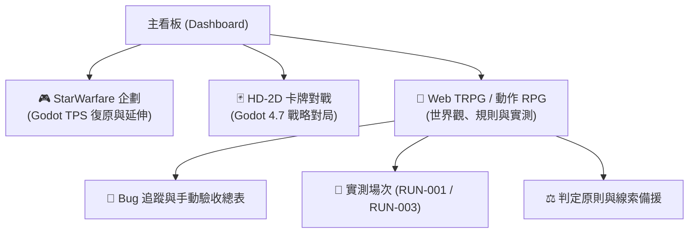

# 🎮 遊戲企劃與開發筆記總覽 (Vault Dashboard)

> [!abstract] **工作區導航說明**
> 本庫收錄目前進行中的三個核心專案：**Star Warfare 射擊遊戲復原**、**HD-2D 戰略卡牌對戰**、以及 **Web TRPG / 2D-3D 動作 RPG**。
> 所有文件均已針對 **Obsidian** 閱讀最佳化，支援雙向鏈接（`[[...]]`）、即時預覽（Page Preview）、大綱導航（Outline）與互動式狀態看板。

---

## 🚀 核心專案快速導航

---

### 1. 🎮 Star Warfare — 復原基礎與未來展望
> [!info] **專案狀態**：Godot 離線復原版進行中｜**當前版本**：v0.4 整理版
> - **專案文檔**：[[Notion/🎮StarWarfare企劃|🎮 StarWarfare 企劃完整文件]]
> - **核心內容**：
>   - **現行已實作**：單人戰役（8 關）、原場景復原（17 張關卡）、47 把武器、裝甲與背包（109 件）、5 款換彈樣板、大陸戰場（3000×3000）。
>   - **待解決衝突**：[[Notion/🎮StarWarfare企劃#四、必須先討論的原案衝突|數值 2.3x 上限與終局公式衝突、等級配件樹範圍]]。
>   - **未來目標**：商店與隨機寶箱雙軌制、模塊與質變系統、手機優先操作體驗。

---

### 2. 🃏 HD-2D 卡牌對戰 — 現行設計與開發進度
> [!info] **專案狀態**：Godot 4.7 / Forward+｜**當前版本**：v2.1 整理版
> - **專案文檔**：[[Notion/HD-2D 卡牌對戰 (暫定) - 遊戲設計文件 v2.0|🃏 HD-2D 卡牌對戰企劃]]
> - **核心內容**：
>   - **現行已實作**：10 個從者槽位、魔力自然上限 7、棄牌回收機制、120 張實裝卡池（從者/靈裝/秘術/瞬咒/伏印）、單人 AI 與 NetClient 伺服器對局。
>   - **待辦核心**：[[Notion/HD-2D 卡牌對戰 (暫定) - 遊戲設計文件 v2.0#尚未完成與原企劃差異|獻祭召喚、完整 Stack 回應鏈、自組牌組與經濟體系]]。

---

### 3. 🎲 2D-3D 動作 RPG & Web TRPG
> [!info] **專案狀態**：`/try` 單人網頁版活躍測試中｜**引擎後端**：`ai-wrapper/apps/trpg-server`
> - **主企劃文檔**：[[Notion/專案名稱：(待定) 2D-3D 動作 RPG 企劃案|🎲 動作 RPG 企劃案與 TRPG 進度]]
> - **測試與驗收中心**：
>   - 🐛 **Bug 總表與手動驗收**：[[Notion/專案名稱：(待定) 2D-3D 動作 RPG 企劃案/TRPG測試/BUGS|TRPG Bug 權威追蹤總表]]（已收錄 B001–B017 完整工程進度與驗收）
>   - 📑 **實測場次索引**：[[Notion/專案名稱：(待定) 2D-3D 動作 RPG 企劃案/TRPG測試/README|場次與測試記錄索引]]
>   - ⚖️ **判定原則與依據**：[[Notion/專案名稱：(待定) 2D-3D 動作 RPG 企劃案/TRPG測試/判定原則與參考|判定原則與參考資料]]
>   - 🧠 **NPC 記憶系統**：[[Notion/專案名稱：(待定) 2D-3D 動作 RPG 企劃案/TRPG測試/NPC反應與互動記憶規劃|NPC 反應階段與互動記憶規劃]]
>   - 🔍 **線索備援盤點**：[[Notion/專案名稱：(待定) 2D-3D 動作 RPG 企劃案/TRPG測試/參考資料/B009-第一章線索備援盤點|B009 第一章線索備援盤點]]

---

## ⚡ 實測場次快速直達

| 場次代號 | 記錄日期 | 角色與模式 | 結果與關鍵觀察 | 快速跳轉 |
| :--- | :--- | :--- | :--- | :--- |
| **RUN-001** | 2026-09-07 | 銀蹄酒館（未定角色） | 止於礦坑外，回報過早進入遊蕩結局；引出 B001–B008 等核心問題 | [[Notion/專案名稱：(待定) 2D-3D 動作 RPG 企劃案/TRPG測試/場次/RUN-001-銀蹄酒館/結果與觀察\|📄 檢視 RUN-001]] |
| **RUN-003** | 2026-09-08 | 你慢吧 / 賞金獵人 | 廢棄磨坊與巨蜘蛛戰鬥倒下；驗證部位耐傷與指定部位規則（B017） | [[Notion/專案名稱：(待定) 2D-3D 動作 RPG 企劃案/TRPG測試/場次/RUN-003-廢棄磨坊/結果與觀察\|📄 檢視 RUN-003]] |

---

## 💡 Obsidian 專用語法與閱讀提示

> [!tip] **最佳閱讀體驗設定**
> 1. **大綱導航（Outline）**：按 `Ctrl + Shift + E` 或點擊右側欄的大綱圖標，可在長篇文件（如 StarWarfare 企劃或 Bug 表）中瞬間跳轉章節。
> 2. **雙鏈懸停預覽（Page Preview）**：滑鼠移至任意 `[[雙括號連結]]` 上，按住 `Ctrl` 即可在不離開當前頁面的情況下快速預覽目標文檔內容。
> 3. **折疊區塊（Foldable Headings / Callouts）**：文件中標有帶有小箭頭的標題與 Callout 區塊均可點擊折疊收起，減少視覺干擾。
> 4. **標籤面板（Tags）**：可透過右側欄標籤面板快速按 `#trpg`、`#bug-tracker`、`#gamedesign` 進行主題篩選。

